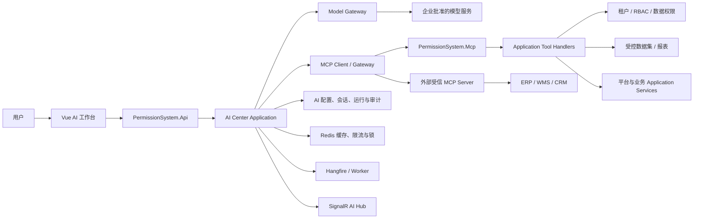
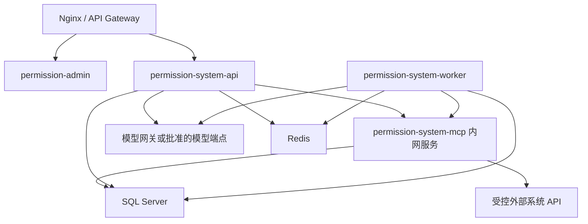
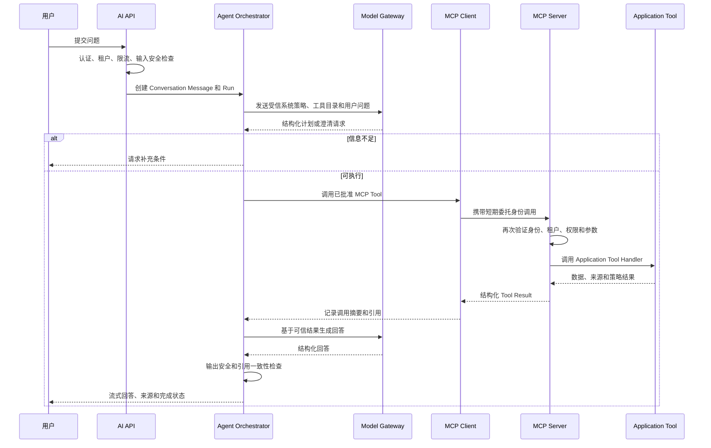
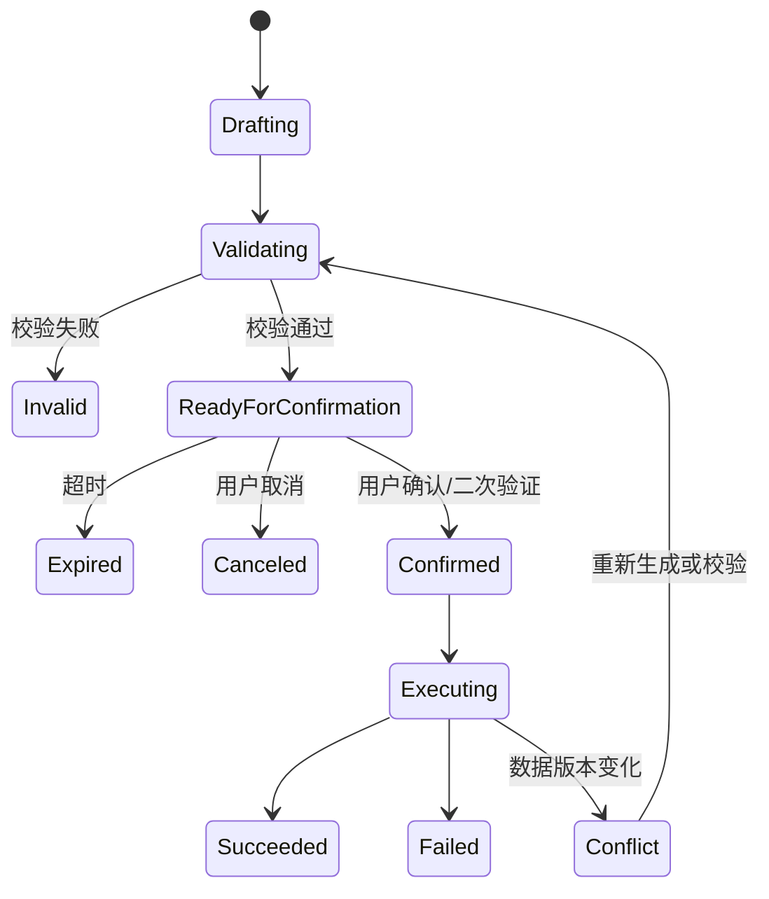

# AI 中心与 MCP 智能问数详细设计方案

## 文档信息

| 项目 | 内容 |
| --- | --- |
| 文档状态 | 方案设计，待实施确认 |
| 版本 | v1.0 |
| 日期 | 2026-08-05 |
| 适用系统 | PermissionSystem 及未来 ERP、WMS 等业务系统 |
| 首期目标 | 基于 MCP 构建企业级 AI 中心，优先实现安全、可审计的只读智能问数能力 |
| 后续目标 | 在同一治理框架下扩展单据草稿生成、人工确认和受控业务执行 |

## 1. 背景与结论

PermissionSystem 已具备多租户、RBAC、数据权限、OpenIddict、报表中心、开放集成中心、工作流、状态机、编号规则、Hangfire、Outbox、RabbitMQ、操作日志和 SignalR 等平台能力。AI 中心应建立在这些能力之上，不另建平行的认证、权限、数据访问或业务执行体系。

本方案采用以下核心定位：

1. AI 中心负责用户会话、模型调用、意图理解、任务规划、工具选择、结果汇总和质量治理。
2. MCP 作为 AI 中心连接内部能力和外部系统的标准工具协议。
3. PermissionSystem 提供受控 MCP Server，工具实现只调用 Application 层用例，不直接访问 `AppDbContext`。
4. AI 中心同时作为 MCP Client，可连接 ERP、WMS 或其他受信 MCP Server。
5. 模型只负责理解和规划，权限判断、数据过滤、业务校验和写操作必须由确定性服务执行。
6. 首期只开放白名单只读工具，不向模型暴露任意 SQL、任意表、任意 URL 或通用写入能力。
7. 后续自动制单采用“草稿、校验、预览、确认或审批、幂等提交、结果审计”的受控流程。

MCP 解决的是工具发现和调用协议问题，不替代模型网关、语义数据层、租户隔离、数据权限、审计、Prompt Injection 防护、连接器治理和业务事务。

## 2. 建设目标与非目标

### 2.1 建设目标

- 提供统一的 AI 对话入口，支持自然语言查询平台和外部业务系统数据。
- 使用 MCP 统一内部工具、外部系统工具和数据资源的描述、发现与调用方式。
- 保证 AI 查询结果不突破当前用户的租户、权限、数据范围和字段敏感级别。
- 建立数据集、指标、维度、字段、业务术语和跨系统编码映射，避免模型猜测统计口径。
- 对回答提供来源、口径、查询时间、关键参数和可追溯执行记录。
- 支持模型供应商可替换、模型配置可治理、成本可统计、失败可降级。
- 为后续单据草稿和受控执行预留统一 Action Tool 模型。
- 支持企业运维需要的日志、指标、追踪、告警、限流、配额、审计和质量评测。

### 2.2 首期非目标

- 不允许模型自由生成并执行 SQL。
- 不允许模型直接读取数据库表、OpenIddict 表、密码哈希、Token、API Secret 等敏感数据。
- 不开放无需确认的自动制单、自动审批或自动变更权限能力。
- 不建设通用低代码 Agent 平台或任意脚本执行环境。
- 不以向量库或 RAG 替代结构化业务数据查询。
- 不在首期实现长期自主运行、自动循环决策或跨租户系统 Agent。
- 不承诺回答所有开放式问题；未注册数据集或工具的问题应明确拒绝或提示能力范围。

## 3. 现有能力评估

### 3.1 可直接复用的能力

| 现有能力 | AI 中心复用方式 |
| --- | --- |
| OpenIddict | 用户登录、Access Token、MCP 访问令牌验证和服务身份管理 |
| RBAC 与权限策略 | 控制 AI 页面、Agent、工具、数据集和管理能力 |
| 多租户与 `ITenantContext` | 所有 AI 会话、运行、工具调用和数据查询强制绑定租户 |
| `ICurrentUserService` | 获取真实用户、权限和操作人，不信任模型传入身份 |
| `IDataScopeService` | 将现有本人、部门、下级部门、自定义部门等数据范围应用到工具查询 |
| 报表中心 | 承载经过审核的只读数据集执行能力，后续演进为语义数据集执行适配器 |
| 开放集成中心 | 复用 API 调用日志、限流、凭证治理经验；外部查询连接器单独定义 |
| 操作日志 | 记录 AI 管理端和外部 API 操作；AI 运行另建细粒度审计记录 |
| Hangfire / Worker | 执行长耗时查询、异步汇总、连接健康检查、归档和评测任务 |
| Redis | 短期会话缓存、工具目录缓存、限流、分布式锁和短期结果缓存 |
| SignalR | 推送运行进度、工具状态和流式回答，避免首期新增另一套实时通信框架 |
| 工作流、状态机、编号规则 | 后续单据草稿确认后的正式业务执行底座 |
| Outbox / RabbitMQ | 后续可靠业务事件、异步通知和跨系统结果分发 |

### 3.2 当前缺口

- 尚无 AI 模型网关、Agent 编排、会话、运行状态和评测模块。
- 尚无 MCP Server、MCP Client、工具注册中心和协议适配层。
- 报表中心当前支持 SQL 数据源，但 SQL 安全隔离治理尚未完成。
- API 报表数据源仍为预留能力，不能直接作为已完成连接器使用。
- 尚无统一的数据集、指标、维度、字段分级和业务术语目录。
- 尚无模型调用成本、Token、延迟、质量和数据泄露风险治理。
- 当前数据权限主要依赖各 Application Service 手动接入；仓库中显式使用 `IDataScopeService`/`ApplyDataPermission` 的业务查询集中在 Demo 业务，不能据此认定所有查询都已自动具备数据范围控制。
- 当前报表查询未统一套用 `IDataScopeService`，仅有租户外层过滤不能替代本人、部门、下级部门和自定义部门等数据范围。
- 当前 OpenIddict 注册的主要资源是 `permission-system-api`，尚无 MCP 专用 resource/audience、scope、客户端和委托身份链路。
- 现有 `OperationLogMiddleware` 面向 `/api` 请求，不能自动覆盖独立 `/mcp` 协议入口及一次 Run 内的多次模型/工具调用。
- 现有事务型 Outbox、工作流并发和外联 SSRF 治理仍有待办项。
- 现有操作日志不足以表达一次 AI Run 内的计划、工具调用、来源和模型信息。

### 3.3 上线前置治理

以下现有架构治理项应纳入 AI 中心路线：

| 治理项 | 对 AI 中心的影响 | 最晚完成阶段 |
| --- | --- | --- |
| EA-001、EA-003 至 EA-005 生产密钥与浏览器 OAuth 治理 | 保证用户登录、Token 存储和生产签名材料达到生产安全要求 | P1 生产灰度前 |
| EA-009、EA-010 状态和权限即时失效 | 保证会话撤销、用户/角色/权限变化能立即阻断 AI 与 MCP | P1 生产灰度前 |
| EA-016 SQL 报表执行安全隔离 | 防止任意 SQL、敏感表和跨租户查询 | 任何 SQL 数据集接入前 |
| EA-017 工作流与状态机并发控制 | 防止后续自动制单重复推进和重复副作用 | 写操作开放前 |
| EA-020 数据权限统一强制机制 | 防止新 Tool、列表、详情和聚合遗漏用户数据范围 | P1 生产灰度前 |
| EA-023 事务型 Outbox | 保证后续单据与集成事件一致提交 | 写操作开放前 |
| EA-024 RabbitMQ/DLQ 治理 | 保证跨系统异步任务可恢复、可重放 | 异步集成规模化前 |
| EA-025 幂等与分布式限流 | 防止模型重试造成重复执行和成本失控 | 写操作开放前；限流首期完成 |
| EA-026 外联安全与 SSRF 防护 | 防止外部 MCP、模型和 API 连接访问内网敏感地址 | 接入任何外部连接前 |
| EA-027 健康、指标、日志归档和告警 | 保证 AI/MCP 故障、成本和安全事件可运营 | P1 生产灰度前 |
| EA-029D API 报表数据源 | 文档、UI 和实际能力保持一致 | 外部 API 数据集上线前 |

## 4. 核心架构决策

### 4.1 决策清单

| 编号 | 决策 | 理由 |
| --- | --- | --- |
| ADR-AI-001 | AI 中心是 Agent 编排者和 MCP Client | 统一模型、会话、计划、成本和质量治理 |
| ADR-AI-002 | 新增独立 `PermissionSystem.Mcp` 宿主 | 将 MCP 协议入口与 Web API 分离，便于网络隔离和独立扩缩容 |
| ADR-AI-003 | MCP Tool 只包装 Application 用例 | 保持现有分层，避免协议层直接访问数据库或承载业务逻辑 |
| ADR-AI-004 | 首期只开放只读白名单工具 | 先验证身份、租户、数据权限、审计和回答质量 |
| ADR-AI-005 | 生产远程 MCP 使用 Streamable HTTP | 适合服务化部署和统一认证；`stdio` 仅限本地开发或诊断 |
| ADR-AI-006 | 浏览器不直连 MCP Server | 避免工具目录、协议接口和凭证暴露给非受控客户端 |
| ADR-AI-007 | 内部调用采用用户委托身份 | AI 权限不得高于提问用户，服务器端再次校验所有权限 |
| ADR-AI-008 | 模型不生成可执行 SQL | 查询使用结构化数据集协议或专用业务工具 |
| ADR-AI-009 | 实时数据用 Tool，稳定元数据用 Resource | 区分动态业务执行和可缓存语义说明 |
| ADR-AI-010 | 写操作使用独立 Action Tool 协议 | 草稿和提交分离，绑定确认凭证、幂等键和业务版本 |
| ADR-AI-011 | 复用 SignalR 推送 AI 运行事件 | 与现有前端实时能力保持一致，不新增实时通信依赖 |
| ADR-AI-012 | 模型与 MCP SDK 通过技术验证后锁定版本 | 避免方案文档绑定未经验证的依赖和协议实现 |

### 4.2 不采用的方案

- 不采用“LLM 直连生产数据库”。该方案无法可靠保证 SQL 安全、租户隔离、数据权限和资源上限。
- 不采用“把所有 Controller 自动暴露成 MCP Tool”。现有 API 粒度、错误模型和写入风险不适合自动发布。
- 不采用“仅靠系统提示词限制权限”。提示词不是安全边界，所有限制必须在服务端执行。
- 不采用“AI 使用超级管理员服务账号，再由提示词约束数据范围”。这会形成典型 Confused Deputy 风险。
- 不采用“首期即支持任意外部 MCP Server”。外部 Server 必须经过登记、审核、网络白名单和工具白名单。

## 5. 总体架构



### 5.1 组件职责

| 组件 | 职责 | 禁止事项 |
| --- | --- | --- |
| Vue AI 工作台 | 对话、运行状态、来源、反馈和管理页面 | 不保存模型密钥，不直连 MCP |
| AI API | 协议入口、认证、DTO、限流、会话命令 | 不直接执行工具或访问 DbContext |
| AI Center Application | 会话、Run 编排、策略判定、工具计划、结果汇总 | 不依赖具体模型 SDK 或 MCP SDK |
| Model Gateway | 模型适配、结构化输出、超时、重试、配额和降级 | 不拥有业务权限决策 |
| MCP Client / Gateway | Server 登记、能力发现、协议调用、连接治理 | 不自动信任远程工具描述 |
| PermissionSystem.Mcp | MCP 认证、工具过滤、协议映射、调用 Application 工具 | 不包含业务流程，不直接访问 DbContext |
| Tool Handler | 结构化业务查询或动作草稿用例 | 不接收可信用户 ID/租户 ID 参数 |
| Semantic Data Catalog | 数据集、字段、指标、口径、敏感级别和映射 | 不存任意未审核 SQL |
| Worker | 长任务、连接健康检查、归档、评测和补偿 | 不持久化用户 Access Token |

### 5.2 信任边界

1. 用户输入不可信。
2. 模型输出不可信，即使输出符合 JSON Schema 也必须重新校验。
3. MCP Tool 描述、MCP Resource 内容和外部系统返回内容均不可信。
4. 只有服务端当前身份、租户上下文、权限服务和数据权限计算结果可信。
5. 数据库中的已发布 Agent、工具和数据集配置只有在版本、状态和授权校验后可信。
6. 外部模型和外部 MCP Server 位于企业信任边界之外，必须经过出站网关和数据分级策略。

### 5.3 建议部署拓扑



- `permission-system-mcp` 默认只在内部网络监听，不直接暴露公网。
- 反向代理仅允许 AI API、受批准的内部客户端或管理诊断端访问 MCP。
- 模型、外部 MCP 和外部 API 的出站访问统一经过允许域名、DNS/IP 校验和超时策略。
- MCP 服务尽量保持无状态，配置和运行数据保存于 SQL Server/Redis，以支持水平扩展。

## 6. 项目分层与目录设计

### 6.1 建议后端目录

```text
backend/
  PermissionSystem.Mcp/
    Program.cs
    Authentication/
    Authorization/
    Protocol/
    Tools/
    Resources/
    Observability/

  PermissionSystem.Application/
    AiCenter/
      Conversations/
      Runs/
      Agents/
      Feedback/
      Policies/
    AiTools/
      Abstractions/
      Catalog/
      Execution/
      BuiltIn/
    AiDataCatalog/
      DataSources/
      Datasets/
      Metrics/
      Mappings/
    AiActions/                 # 后续阶段
      Drafts/
      Confirmations/
      Execution/
    Abstractions/
      IAiModelClient.cs
      IMcpToolClient.cs
      IAiSecretProvider.cs
      IAiContentPolicy.cs

  PermissionSystem.Domain/
    Entities/
      AiAgent.cs
      AiAgentVersion.cs
      AiConversation.cs
      AiMessage.cs
      AiRun.cs
      AiRunStep.cs
      AiToolDefinition.cs
      AiToolInvocation.cs
      AiDataSource.cs
      AiDataset.cs
      AiDatasetField.cs
      AiMetricDefinition.cs
    Enums/
      AiRunStatus.cs
      AiToolRiskLevel.cs
      AiDataClassification.cs

  PermissionSystem.Infrastructure/
    Ai/
      Models/
      Mcp/
      Connectors/
      Security/
      Caching/
    Configurations/
      Ai*.cs
```

实际实施时可按阶段拆分文件，首期不得一次性创建所有后续实体。

### 6.2 依赖方向

```text
PermissionSystem.Api ─┐
PermissionSystem.Mcp ─┼──> PermissionSystem.Application ──> PermissionSystem.Domain
PermissionSystem.Worker ┘                  ▲
                                           │
                           PermissionSystem.Infrastructure
                              实现 Application 抽象
```

- `PermissionSystem.Mcp` 是新的组合根，与 `Api`、`Worker` 同级。
- `Application` 不引用 MCP SDK、具体模型 SDK、HTTP Client 实现或 EF Core。
- MCP 协议 DTO 在 `PermissionSystem.Mcp` 内转换为 Application Request/Response。
- 业务 Tool Handler 调用现有 Application 服务或专用查询服务，不从 MCP 层使用仓储。
- 通用结果类型继续使用项目现有 `ApiResult` / `PagedResult`；MCP 层再映射为协议结果。

## 7. MCP 架构设计

### 7.1 MCP 角色

| 角色 | 本系统实现 | 说明 |
| --- | --- | --- |
| MCP Host/Client | AI Center | 管理多个 MCP Server 连接并调用工具 |
| 内部 MCP Server | `PermissionSystem.Mcp` | 发布本平台受控工具和资源 |
| 外部 MCP Server | ERP/WMS/CRM 或适配服务 | 必须登记、审核、隔离和限权 |
| Tool Provider | Application Tool Handler | 真正执行确定性业务查询或动作 |
| Resource Provider | 数据目录和业务元数据服务 | 提供稳定、可缓存、脱敏的业务说明 |

### 7.2 传输方式

- 生产环境：采用远程 Streamable HTTP，并通过 TLS、反向代理、身份验证和网络策略保护。
- 本地开发：可选 `stdio` 启动最小验证 Server，但不作为部署形态。
- 浏览器只访问 AI API 和 SignalR Hub，不直接访问 `/mcp`。
- MCP 请求必须支持 `CancellationToken`、请求超时和最大响应体限制。
- 是否启用协议的会话恢复、服务端通知等扩展能力，在 SDK 技术验证后决定；首期只使用必要能力。

### 7.3 MCP 能力使用边界

#### Tools

用于实时、参数化、需要权限判断的查询或操作，例如查询库存、获取订单详情、生成单据草稿。

#### Resources

用于相对稳定的业务元数据，例如：

- 数据集说明和字段口径。
- 指标、维度和业务术语定义。
- 字典、状态定义和单据字段 Schema。
- 已脱敏的操作规范和帮助文档。

资源 URI 建议使用稳定命名：

```text
permission://datasets/{datasetCode}
permission://metrics/{metricCode}
permission://business-types/{businessType}/schema
permission://dictionaries/{dictionaryCode}
```

#### Prompts

- MCP Prompt 只用于可复用的非敏感任务模板。
- Agent 的可信系统指令和安全策略仍由 AI 中心版本化管理。
- 外部 MCP Server 返回的 Prompt 不能覆盖 AI 中心系统策略。

#### 首期禁用能力

- 不允许外部 MCP Server 反向请求模型执行任意采样。
- 不允许动态安装未知 Tool。
- 不允许 Tool 返回可自动执行的脚本、SQL 或后续工具指令。
- 不允许模型根据 Tool 描述自行提升权限或改变租户。

### 7.4 工具注册元数据

每个工具至少包含以下元数据：

| 字段 | 说明 |
| --- | --- |
| `ToolCode` | 租户内稳定唯一编码 |
| `Version` | 契约版本，发布后不可原地破坏性修改 |
| `DisplayName` | 管理端展示名称 |
| `Description` | 清晰描述用途、边界和返回口径 |
| `SourceType` | Internal、ExternalMcp、RestApi、ControlledDataset |
| `OperationType` | Read、Draft、Write、Admin |
| `RiskLevel` | Low、Medium、High、Critical |
| `RequiredPermission` | 必须满足的 PermissionSystem 权限码 |
| `RequiredScopes` | MCP/OAuth 访问范围 |
| `DataScopeMode` | 是否应用当前用户数据范围及适用字段 |
| `InputSchema` | 严格 JSON Schema |
| `OutputSchema` | 结构化输出 Schema |
| `SchemaHash` | 已审核输入/输出 Schema 的摘要，用于检测远端变化 |
| `TimeoutSeconds` | 单次调用超时 |
| `MaxRows` | 最大返回行数 |
| `IsIdempotent` | 是否允许安全重试 |
| `RequiresConfirmation` | 是否必须由用户确认 |
| `DataClassification` | 工具可能返回的最高数据级别 |
| `IsEnabled` | 当前租户是否启用 |

工具目录可以按权限过滤后返回给模型，但执行时必须再次校验，不能把“未列出”作为唯一安全措施。

### 7.5 工具命名

建议使用领域命名，避免技术表名：

```text
permission.users.search
permission.departments.get
permission.reports.query_dataset
erp.orders.get
wms.inventory.query_summary
wms.inventory.get_movement_detail
business.demo_order.prepare_draft
business.demo_order.submit_draft
```

- 名称包含系统或领域前缀。
- 一个工具只承担一个清晰用例。
- 查询和写入使用不同工具。
- 不使用 `execute_sql`、`query_table`、`call_url`、`create_any_document` 等泛化工具。

### 7.6 统一输入与输出

业务工具输入只包含业务参数，不包含可信身份参数：

```json
{
  "datasetCode": "wms.inventory.summary",
  "filters": [
    { "field": "warehouseCode", "operator": "eq", "value": "WH01" }
  ],
  "dimensions": ["itemCode", "itemName"],
  "metrics": ["onHandQuantity", "availableQuantity"],
  "sort": [{ "field": "availableQuantity", "direction": "asc" }],
  "pageIndex": 1,
  "pageSize": 50
}
```

`TenantId`、用户 ID、权限、部门范围和敏感字段策略由服务端上下文注入。

统一输出建议包含：

```json
{
  "data": [],
  "summary": {
    "rowCount": 0,
    "isTruncated": false
  },
  "schemaVersion": "1.0",
  "source": {
    "system": "WMS",
    "datasetCode": "wms.inventory.summary",
    "datasetVersion": 3,
    "queriedAt": "2026-08-05T10:00:00+08:00",
    "asOf": "2026-08-05T09:59:52+08:00",
    "timezone": "Asia/Shanghai",
    "currency": null
  },
  "appliedFilters": [],
  "appliedPolicies": {
    "tenantFiltered": true,
    "dataScopeApplied": true,
    "maskedFields": []
  },
  "citations": [],
  "traceId": "server-generated-trace-id"
}
```

### 7.7 错误模型

工具错误必须结构化，不向模型返回堆栈、连接串或内部异常：

| 错误码 | 场景 | AI 行为 |
| --- | --- | --- |
| `AI_TOOL_FORBIDDEN` | 用户无工具或数据权限 | 明确拒绝，不尝试绕过 |
| `AI_TOOL_INVALID_ARGUMENT` | 参数不符合 Schema 或业务规则 | 修正一次或请求用户补充 |
| `AI_DATASET_NOT_FOUND` | 数据集不存在或未发布 | 告知当前不支持 |
| `AI_SOURCE_UNAVAILABLE` | 外部系统不可用 | 降级或提示稍后重试 |
| `AI_RESULT_TOO_LARGE` | 结果超限 | 建议缩小条件或使用异步导出 |
| `AI_TOOL_TIMEOUT` | 调用超时 | 只对幂等查询按策略重试 |
| `AI_CONFIRMATION_REQUIRED` | 写操作缺少有效确认 | 返回草稿并要求确认 |
| `AI_CONCURRENCY_CONFLICT` | 数据版本已变化 | 重新校验并要求再次确认 |

## 8. 首期 MCP 工具规划

### 8.1 平台内置只读工具

| ToolCode | 用途 | 权限建议 | 数据范围 |
| --- | --- | --- | --- |
| `permission.users.search` | 按条件查询用户摘要 | `ai:tool:user-query` + 原用户查看权限 | 复用用户可见范围 |
| `permission.departments.search` | 查询组织和部门 | `ai:tool:department-query` + 原部门查看权限 | 当前租户 |
| `permission.roles.summary` | 查询角色与授权摘要 | `ai:tool:role-query` | 不返回敏感授权细节，按权限过滤 |
| `permission.login_logs.summary` | 查询登录统计 | `ai:tool:login-log-query` | 当前租户和日志权限 |
| `permission.operation_logs.summary` | 查询操作统计 | `ai:tool:operation-log-query` | 当前租户和日志权限 |
| `permission.workflows.summary` | 查询流程运行统计 | `ai:tool:workflow-query` | 用户可见实例和任务 |
| `permission.reports.query_dataset` | 执行已发布受控数据集 | `ai:tool:dataset-query` + 数据集权限 | 数据集强制策略 |
| `permission.catalog.get_definition` | 获取指标和字段定义 | `ai:chat:use` | 只返回已发布元数据 |

实际工具是否上线以现有业务服务是否具备正确数据权限为准，不应为了扩大 AI 覆盖范围而绕过已有查询规则。

### 8.2 外部系统工具

首个外部系统接入时，优先选择 3 至 5 个高价值、低风险、口径明确的工具，例如：

- `wms.inventory.query_summary`
- `wms.inventory.get_item_stock`
- `erp.sales_orders.query_summary`
- `erp.purchase_orders.get`
- `erp.customers.get_balance_summary`

不得在未确认目标系统、正式 API、租户映射和业务口径前编造具体请求字段或接口地址。

### 8.3 工具发布流程

```text
Draft -> SchemaValidated -> SecurityReviewed -> Tested -> Published -> Disabled/Archived
```

1. 开发者定义 Application Tool Handler 和契约。
2. 自动执行 Schema、权限、租户和契约测试。
3. 安全管理员审核数据分级、外联地址、字段脱敏和风险等级。
4. 业务负责人确认指标口径和示例结果。
5. 发布生成不可变工具版本。
6. Agent 只能绑定已发布版本；升级需灰度和回归评测。

## 9. 语义数据目录与智能问数

### 9.1 建设原因

自然语言中的“库存”“可用量”“销售额”“有效用户”等概念不能直接映射为表字段。若缺少统一语义目录，不同模型或不同时间可能产生不同查询口径。因此智能问数的核心不是 Text-to-SQL，而是“自然语言到受控数据集、指标、维度和过滤条件”的映射。

### 9.2 核心概念

| 概念 | 说明 |
| --- | --- |
| DataSource | 数据来源和连接方式，例如 PermissionSystem、ERP API、WMS MCP |
| Dataset | 可查询的业务数据集合，包含权限、时效、行数和执行策略 |
| Field | 可过滤、分组、展示或排序的字段 |
| Metric | 有明确聚合方式和口径的指标 |
| Dimension | 用于分组或切片的业务维度 |
| BusinessTerm | 自然语言同义词、缩写和解释 |
| EntityMapping | 跨系统客户、物料、仓库等主数据编码映射 |
| DataPolicy | 租户过滤、数据范围、字段脱敏、最大行数和导出限制 |

每个已发布 Dataset/Metric 还应明确 Owner、业务粒度、来源血缘、单位、币种、时区、业务日历、刷新频率和质量状态。缺少 Owner 或口径未确认的对象不得发布给生产 Agent。

### 9.3 数据源优先级

1. 现有 Application 查询服务或专用只读 Tool Handler。
2. 正式、版本化、受认证的业务 API。
3. 经过审核的外部 MCP Server Tool。
4. 独立只读账号访问的白名单 View/Dataset。

禁止模型直连主库，也不允许把只读账号作为唯一安全措施；数据库权限、视图白名单、租户注入、字段白名单、查询超时和行数限制必须同时存在。

### 9.4 结构化查询协议

数据集工具只接受白名单字段和操作符：

- 比较：`eq`、`ne`、`gt`、`gte`、`lt`、`lte`。
- 集合：`in`、`notIn`，元素数量受限。
- 文本：`contains`、`startsWith`，仅允许标记为可搜索的字段。
- 时间：`between`、`before`、`after`，必须明确时区。
- 空值：`isNull`、`isNotNull`。

服务端负责：

- 校验字段、操作符和参数类型。
- 强制注入租户条件和数据范围。
- 生成参数化查询或调用业务 API。
- 限制分页、排序、分组、最大时间范围和最大行数。
- 应用字段级脱敏和结果级安全策略。
- 返回数据来源、口径版本、查询时间和截断状态。

### 9.5 与现有报表中心的关系

- 首期可以将已审核的 `ReportDefinition` 映射为只读 Dataset，但不能直接把所有报表定义暴露给模型。
- 在 EA-016 完成前，使用当前主库连接执行的 SQL 报表不得进入 AI 工具目录。
- 在 EA-020 完成且对应数据策略落地前，报表的租户过滤不能被表述为完整用户数据权限；列表、详情和聚合必须通过同一 DataScope Policy 验证。
- 长期建议从“报表保存 SQL”演进为“数据集定义 + 执行适配器”，报表页面和 AI Tool 共用同一数据集。
- 报表导出仍使用独立权限；AI 聊天默认只返回小规模摘要和分页结果。

### 9.6 跨系统查询

跨系统查询遵循以下规则：

- 每个系统先在本系统边界内完成权限校验和结果裁剪。
- 只传递完成关联所需的最小字段。
- 大规模 Join 不在模型上下文或内存中完成，应建设专用聚合数据集、只读分析库或受控聚合服务。
- 客户、物料、仓库、组织等主数据必须有明确映射，不按名称进行模糊猜测关联。
- 回答展示每个来源的 `asOf` 时间，避免把不同时间点的数据表述为强一致结果。
- 某一来源失败时，必须明确说明结果不完整，不能静默忽略。

### 9.7 回答引用

每个可验证结论应关联一个或多个内部引用：

```text
Citation
  - RunId
  - ToolInvocationId
  - SourceSystem
  - DatasetCode / ToolCode
  - DatasetVersion / ToolVersion
  - QueryParametersDigest
  - QueriedAt
  - AsOf
  - RowCount
```

前端默认显示用户可理解的来源名称、数据时间和口径；管理员可按权限查看更详细的调用记录。引用不得暴露内部 SQL、Secret、网络地址或被脱敏字段原值。

## 10. AI Center 编排设计

### 10.1 一次问答的处理流程



### 10.2 Run 状态机

```text
Created
  -> Validating
  -> Planning
  -> WaitingForUser       # 需要澄清
  -> ExecutingTools
  -> Synthesizing
  -> Completed

任意执行态 -> CancelRequested -> Canceled
任意执行态 -> Failed
任意执行态 -> TimedOut
```

- 状态转换必须使用并发控制，避免重复完成或取消后继续写入结果。
- 用户断开连接不等于自动取消 Run；前端可重连获取状态。
- 首期同步查询可在 API 进程完成；超过阈值的任务转入 Worker，但必须重新验证用户和租户状态。

### 10.3 编排策略

- Agent 只能看到已绑定且当前用户有权使用的 Tool。
- 单次 Run 设置最大模型轮次、最大工具调用数、最大总耗时、最大结果行数和 Token 预算。
- 模型返回工具参数后，先执行 JSON Schema 校验，再执行业务校验。
- 同一幂等只读调用可按策略重试；写调用不得由通用模型重试逻辑自动重试。
- 如果两个工具可以并行且没有依赖，可并行执行，但需受并发和下游限流控制。
- 工具返回的数据先归一化和裁剪，再进入模型上下文。
- 不保存或展示模型的隐藏推理过程；只保存简洁的计划摘要、调用事件和可审计依据。

### 10.4 澄清策略

以下情况必须向用户澄清，不允许模型自行猜测：

- 业务术语映射到多个指标或数据集。
- 缺少租户之外的业务范围，例如仓库、组织、日期区间。
- 用户请求“最近”“本期”等相对时间但系统无法确定业务日历。
- 跨系统主数据编码存在多个候选。
- 查询结果可能非常大或成本明显超限。
- 后续写操作存在多个业务类型、币种、组织或审批路径。

### 10.5 会话与记忆

- 短期上下文按 Conversation 保存，并根据 Token 预算压缩为事实摘要。
- 摘要必须区分“用户输入”“工具事实”“模型结论”，不得把模型推测保存为事实。
- 不允许跨租户共享会话、缓存、摘要或用户偏好。
- 长期用户偏好应单独授权和可删除，首期不建设隐式长期记忆。
- 删除会话不应破坏必须依法保留的安全审计；会话内容和审计摘要采用不同留存策略。

### 10.6 实时推送

复用 SignalR，新建 `/hubs/ai`：

- `run.started`
- `run.progress`
- `run.waiting_for_user`
- `tool.started`
- `tool.completed`
- `answer.delta`
- `run.completed`
- `run.failed`

SignalR Group 使用用户和 Run 维度隔离。加入 Group 前验证 Run 的归属和当前用户权限，不能仅凭客户端提交 RunId。

### 10.7 降级策略

- 模型不可用：保留问题和 Run 状态，提示当前不可用，不执行工具。
- 单个数据源不可用：允许返回明确标记的不完整结果，不生成完整性结论。
- Redis 不可用：关键权限和租户校验继续使用权威数据源，非关键缓存降级；分布式限流失效时生产环境应 fail-closed 或由网关接管。
- Worker 不可用：同步小查询可继续，异步任务进入排队或明确拒绝。
- MCP Server 不可用：停止对应工具调用，不回退到数据库直连。

## 11. 模型网关设计

### 11.1 抽象边界

Application 层定义模型无关接口，例如：

```csharp
public interface IAiModelClient
{
    Task<AiModelResponse> CompleteAsync(
        AiModelRequest request,
        CancellationToken cancellationToken = default);
}
```

该接口只表达项目需要的能力：

- 结构化文本生成。
- Tool Calling。
- JSON Schema 约束输出。
- 流式输出。
- Token 使用量和结束原因。
- 模型超时、取消和供应商错误分类。

具体供应商 SDK 和 HTTP 协议只存在于 Infrastructure。业务服务不能直接引用某一家模型的类型、模型名称或异常类型。

### 11.2 模型配置

模型配置采用 `ModelProfile`，而不是把模型名写在 Agent 代码中：

| 配置 | 说明 |
| --- | --- |
| `ProfileCode` | 稳定编码，例如 `ai-query-primary` |
| `ProviderType` | 模型供应商适配器类型 |
| `ModelName` | 部署环境中的模型标识 |
| `EndpointRef` | 端点配置引用，不直接回传给前端 |
| `SecretRef` | 密钥管理系统引用，不保存明文 |
| `DataResidency` | 数据处理区域或部署边界 |
| `MaxContextTokens` | 上下文上限 |
| `MaxOutputTokens` | 单次输出上限 |
| `SupportsTools` | 是否支持结构化工具调用 |
| `SupportsJsonSchema` | 是否支持严格结构化输出 |
| `TimeoutSeconds` | 单次模型调用超时 |
| `FallbackProfileCode` | 允许的降级模型 |
| `IsEnabled` | 是否启用 |

模型配置由平台管理员维护，租户只可在管理员授权的 Profile 范围内选择。涉及数据出境或敏感数据的租户，可以强制绑定私有部署模型。

### 11.3 Prompt 管理

- 系统 Prompt、任务 Prompt、回答格式和安全规则分层保存并版本化。
- Agent 发布时绑定不可变 AgentVersion、PromptVersion、ToolVersion 和 DatasetVersion。
- Prompt 变更必须经过测试集回归，不直接覆盖生产版本。
- Prompt 不保存 Secret、连接串或真实凭证。
- 业务字段规则优先放在结构化元数据和确定性校验中，不依赖自然语言 Prompt。
- 外部 Tool Result 必须标记为不可信数据，不能作为系统指令解析。

### 11.4 数据最小化

发送给模型前必须执行：

1. 只选择回答所需字段和行。
2. 移除内部 ID、技术字段和不必要的个人信息。
3. 按字段分级执行遮盖、哈希、截断或拒绝发送。
4. 对大结果先在服务端聚合，再发送摘要。
5. 标记来源和数据时间，但不发送连接信息。
6. 记录发送内容摘要、分类级别和 Token，不默认记录全部原始 Prompt。

### 11.5 路由、重试与降级

- 简单意图分类可使用低成本模型，复杂工具规划使用支持严格 Tool Calling 的模型。
- 只对网络错误、限流等瞬时故障重试，且设置最大次数和抖动退避。
- 模型调用重试不会自动重放非幂等 Tool。
- 降级模型必须满足同等数据驻留和安全等级，不允许为了可用性把受限数据发送到未批准模型。
- 达到用户、租户或平台预算时终止 Run，并返回明确的配额状态。

### 11.6 成本治理

按以下维度记录和汇总：

- 租户、用户、Agent、AgentVersion。
- ModelProfile、实际模型和供应商。
- 输入 Token、输出 Token、缓存 Token（若供应商支持）。
- 模型调用次数、工具调用次数、持续时间。
- 估算费用和预算命中情况。
- 成功、失败、取消、超时和降级次数。

成本统计用于运营和限额，不作为财务结算的唯一依据，除非后续建设经过对账的计费模块。

## 12. 数据源与连接器设计

### 12.1 连接器类型

| 类型 | 使用场景 | 实现边界 |
| --- | --- | --- |
| InternalApplication | PermissionSystem 内部能力 | 直接调用 Application Tool Handler |
| ControlledDataset | 受控 SQL View 或分析数据集 | 独立只读连接、白名单、强制策略 |
| RestApi | ERP/WMS 正式 API | 命名 HttpClient、认证、Schema 适配 |
| ExternalMcp | 外部系统 MCP Server | MCP Client、工具白名单、协议审计 |
| AnalyticsService | 专用统计或语义查询服务 | 适合大聚合、跨系统和历史分析 |

现有开放集成中心主要解决外部客户端、Webhook 和开放接口问题。AI 数据源属于平台主动出站查询，凭证语义和风险不同，不应直接复用 `ApiClientSecret` 作为外部连接凭证。可以复用加密、日志、限流和健康检查模式，但应新增独立的 DataSource/Connection 配置。

### 12.2 生命周期

```text
Draft -> Testing -> Ready -> Enabled -> Degraded -> Disabled -> Archived
```

- Draft：配置未完成，不允许 Agent 使用。
- Testing：仅管理员执行连接和 Schema 测试。
- Ready：测试通过但尚未向租户或 Agent 发布。
- Enabled：允许被已授权 Tool 使用。
- Degraded：健康检查失败或达到错误阈值，只允许受控重试。
- Disabled：停止新调用。
- Archived：保留历史引用，不允许恢复原 Secret。

### 12.3 凭证治理

- 数据库只保存 `SecretRef`、凭证类型、到期时间和最后轮换时间。
- Secret 由环境密钥管理、企业 Secret Manager 或受保护配置提供。
- 管理端创建后不回显明文；连接测试日志不记录请求头和凭证。
- 不同租户、数据源和环境使用不同凭证，不共享生产凭证到测试环境。
- 支持凭证轮换、到期告警和禁用后的连接清理。
- MCP 外部 Server 支持服务身份或经过明确设计的用户委托身份，二者不得隐式混用。
- 默认不向外部 MCP Server 转发 PermissionSystem 用户 Access Token。外部 Server 使用每租户专用的最小权限凭证；确需跨系统用户委托时，必须单独完成协议、身份映射和风险评审。

### 12.4 外联安全

所有模型、REST、Webhook 和外部 MCP 请求共用外联安全策略：

- Production 默认强制 HTTPS。
- 使用允许域名和端口白名单。
- DNS 解析后校验所有 IP，阻止环回、链路本地、私网和云元数据地址，除非平台级显式白名单。
- 限制重定向次数，并对每次重定向重新执行目标校验。
- 防止 DNS Rebinding，连接建立前后保持校验结果一致。
- 设置连接、请求、读取超时、最大响应体和最大并发。
- 对响应 Content-Type 和 JSON Schema 校验。
- 不允许管理员用“测试连接”接口扫描内网。
- 外部返回的 URL、Tool 描述和 Resource 内容不得触发新的未授权外联。

### 12.5 租户与主数据映射

外部连接必须明确：

- 本租户对应外部系统中的组织、账套或 Tenant Code。
- 外部用户委托身份是否存在；不存在时服务身份可读取的最大范围。
- 部门、仓库、客户、供应商、物料等主数据映射来源和维护责任。
- 映射冲突、失效和缺失时的处理方式。

映射值由服务器根据当前 TenantId 选择，模型不能传入外部账套编码来切换租户。

### 12.6 一致性和时效

每个 Dataset/Tool 必须声明：

- 数据是实时、准实时、缓存还是 T+1。
- `asOf` 时间如何获取。
- 是否允许缓存及缓存键包含哪些身份和范围因素。
- 跨系统数据是否具有事务一致性。

缓存键至少包含 TenantId、UserId 或数据范围摘要、ToolVersion、参数摘要和数据策略版本。禁止只按问题文本缓存业务结果。

## 13. 身份、权限与多租户设计

### 13.1 身份链路

```text
用户 Access Token
  -> AI API 验证
  -> 创建当前用户/租户 Run 上下文
  -> AI Center 获取短期委托调用凭证
  -> PermissionSystem.Mcp 再次验证
  -> Tool Handler 使用服务器解析的 ICurrentUserService / ITenantContext
```

- MCP Server 不信任 AI Center 传入的普通 Header 身份字段。
- 普通用户的 TenantId 由认证 Claim 和服务器租户上下文确定。
- 超级管理员跨租户查询必须沿用项目“显式目标租户”规则，并完整审计目标租户。
- UserId、TenantId、RoleId、DepartmentId 等不可作为工具中的可信授权参数。

当前系统主要使用 `permission-system-api` resource。MCP 落地时应继续扩展 OpenIddict 正式认证体系，不新增平行 JWT 发行器：

1. 注册 `permission-system-mcp` resource/audience 和最小 MCP scopes。
2. 预注册 AI Center 的受信客户端身份，限制授权方式、回调地址和可申请 scope。
3. MCP Server 强制校验 issuer、signature、audience、scope、有效期和会话状态。
4. 优先使用经 P0 验证的标准用户委托机制签发短期、不可刷新的 MCP 调用令牌。
5. 委托身份至少绑定真实用户 `sub`、AI 服务 Actor、TenantId、SessionId、AgentRunId、允许 scopes 和短 TTL。
6. 若候选 SDK/OpenIddict 组合不能安全支持目标委托流程，应在 P0 停止并重新评审，不得自建另一套长期 Token 或使用宽权限 API Key 替代。

MCP 调用需要同时表达：

- OriginalActor：真实提问用户。
- ServiceActor：代表用户执行编排的 AI Center 服务。
- EffectiveTenant：服务端解析并验证的目标租户。

权限判断始终以真实用户的当前有效权限为上限。服务 Actor 仅证明调用来源受信，不能为用户增加业务权限。

### 13.2 异步任务身份

长任务不得把用户 Access Token 明文保存到数据库或 Hangfire 参数中。建议：

1. Run 保存原始 ActorId、TenantId、授权范围摘要和创建时间。
2. Worker 使用内部服务身份启动执行。
3. 执行前重新检查租户为 Active、用户仍有效、Agent/Tool/Dataset 仍启用。
4. 根据当前权限重新计算数据范围，不仅依赖创建时快照。
5. 审计同时记录 OriginalActor 和 ExecutionActor。
6. 如果权限变化导致范围缩小，按当前权限执行；如果已无权限则终止。

如果未来存在必须固定权限快照的合规场景，应单独评审，不在首期默认实现。

### 13.3 权限码建议

| 权限码 | 用途 |
| --- | --- |
| `ai:chat:use` | 使用 AI 问答 |
| `ai:conversation:view-own` | 查看本人会话 |
| `ai:conversation:delete-own` | 删除本人可删除的会话内容 |
| `ai:run:view-own` | 查看本人 Run 和来源 |
| `ai:feedback:create` | 提交回答反馈 |
| `ai:agent:view` | 查看已发布 Agent |
| `ai:agent:manage` | 管理 Agent 草稿和版本 |
| `ai:agent:publish` | 发布或下线 Agent |
| `ai:tool:view` | 查看工具目录 |
| `ai:tool:manage` | 管理工具配置 |
| `ai:tool:publish` | 发布工具版本 |
| `ai:dataset:view` | 查看数据集元数据 |
| `ai:dataset:manage` | 管理数据集和字段 |
| `ai:dataset:publish` | 发布数据集 |
| `ai:data-source:view` | 查看脱敏数据源配置 |
| `ai:data-source:manage` | 创建和测试数据源 |
| `ai:run-log:view` | 查看 AI 运行审计 |
| `ai:model-profile:manage` | 管理模型 Profile |
| `ai:action:confirm` | 确认本人可执行的业务草稿 |
| `ai:action:audit` | 查看高风险动作审计 |

工具还必须叠加原业务权限。例如拥有 `ai:tool:user-query` 不代表自动拥有用户模块全部数据，应同时满足用户查看权限和数据范围。

### 13.4 Agent 授权

Agent 发布时定义：

- 可使用的角色、部门、用户或租户范围。
- 可绑定的 ModelProfile。
- 可使用的 ToolVersion 和 DatasetVersion。
- 单次 Run 的风险、成本和调用上限。
- 可访问的最高数据级别。
- 是否允许外部模型和外部 MCP。
- 是否允许生成草稿或发起写操作。

有效权限取以下交集：

```text
用户权限
∩ Agent 授权
∩ Tool 权限
∩ Dataset 权限
∩ 数据源可用范围
∩ 当前租户与数据范围
∩ 平台安全策略
```

任何一层拒绝都必须终止调用。

## 14. 安全设计

### 14.1 数据分级

建议定义四级数据分类：

| 级别 | 示例 | 默认 AI 策略 |
| --- | --- | --- |
| Public | 对外公开说明 | 可发送到批准模型 |
| Internal | 普通内部业务摘要 | 仅发送到企业批准模型 |
| Confidential | 客户、金额、员工业务数据 | 最小化、脱敏、授权后发送 |
| Restricted | 密码、Token、Secret、身份证完整值、密钥材料 | 禁止进入模型和 Tool Result |

字段分类由 DatasetField 或 Tool 输出契约定义，模型不能自行判断敏感级别。

### 14.2 主要威胁与控制

| 威胁 | 控制措施 |
| --- | --- |
| 用户 Prompt Injection | 系统策略优先、工具白名单、参数 Schema、服务端权限校验 |
| 间接 Prompt Injection | 外部内容标记为数据、禁止其改变指令、输出清洗和工具计划复核 |
| Tool Poisoning | Server 审核、Tool 描述签名/版本固定、禁用动态未知 Tool |
| Confused Deputy | 用户委托身份、权限交集、服务端重新授权 |
| 跨租户越权 | TenantId 服务端解析、全局过滤、关联对象一致性和专项测试 |
| SQL 注入和敏感表读取 | 结构化查询、参数化、只读账号、View 白名单、EA-016 |
| SSRF 与内网探测 | 统一出站策略、DNS/IP 校验、域名白名单、重定向限制 |
| 数据外泄 | 字段分级、脱敏、最小化、模型 Profile 数据驻留策略 |
| Secret 泄露 | SecretRef、日志脱敏、Prompt/Tool Result 禁止包含 Secret |
| 重放和重复执行 | Run/Invocation Id、幂等键、确认凭证、版本和时间窗 |
| 模型幻觉 | 只基于 Tool 事实回答、引用校验、不支持时明确拒绝 |
| 资源和成本滥用 | 用户/租户限流、Token/步骤/行数预算、并发控制 |
| 大结果拖垮服务 | 分页、聚合、最大响应体、异步导出、超时和取消 |
| 审计数据泄露 | 审计摘要化、敏感字段清洗、审计访问独立权限 |

### 14.3 内容安全流水线

输入阶段：

- 限制字符数、附件类型和附件大小。
- 识别明显的密钥、Token、连接串等敏感内容并阻止或遮盖。
- 对越权、绕过安全和任意执行请求直接拒绝。
- 记录风险标签，不记录已识别出的完整 Secret。

工具阶段：

- 严格 Schema 校验。
- 权限、租户、数据范围和字段策略校验。
- 参数数量、时间范围、分页和行数限制。
- Tool Result 归一化、脱敏和不可信内容标记。

输出阶段：

- 引用与结论一致性检查。
- 检查是否泄露 Restricted 字段、内部地址、SQL、堆栈或 Secret。
- 对数字结论优先使用服务端计算值，不让模型重新计算大规模明细。
- 对不完整数据、缓存数据和估算值明确标注。

### 14.4 审计要求

必须记录：

- Actor、TenantId、TraceId、ConversationId、RunId。
- AgentVersion、ModelProfile、模型标识和 PromptVersion。
- 用户问题的安全摘要或经策略允许的原文。
- 可用工具目录摘要、实际 ToolVersion、参数摘要和结果摘要。
- 权限结果、数据范围摘要、脱敏字段和拒绝原因。
- 数据来源、查询时间、行数、持续时间和错误码。
- Token、成本、重试、降级、取消和最终状态。
- 后续 Action 的草稿摘要、确认人、确认时间、幂等键和业务结果。

默认不记录：

- 模型隐藏推理过程。
- Access Token、Refresh Token、API Secret、Cookie、连接串。
- Restricted 字段原值。
- 未经策略批准的完整模型请求和完整 Tool Result。

## 15. 后续自动制单扩展设计

自动制单不是首期范围，但必须在 AI 中心模型中预留安全边界。

### 15.1 操作分层

| 类型 | 示例 | 默认要求 |
| --- | --- | --- |
| Read | 查询库存、订单、用户 | 权限和数据范围 |
| Draft | 生成采购申请草稿 | 权限、Schema、业务校验，不写正式单据 |
| Write | 提交采购申请 | 人工确认、幂等、重新校验、审计 |
| HighRisk | 审批、付款、权限分配 | 二次验证或工作流，首期不开放 |

### 15.2 标准流程



### 15.3 草稿与确认约束

- 草稿使用结构化业务 DTO，不保存模型自由文本作为执行载荷。
- 草稿记录 BusinessType、HandlerVersion、Payload、PayloadHash、来源、创建人、TenantId 和过期时间。
- 业务服务验证必填字段、关联对象租户、金额、库存、状态和当前用户权限。
- 前端展示即将执行的明确变化、关键字段、数据来源和审批影响。
- 确认凭证绑定 Actor、TenantId、DraftId、PayloadHash、HandlerVersion 和过期时间。
- 草稿修改后原确认立即失效。
- 正式执行前重新验证权限、租户、业务状态、关联数据和并发版本。
- 提交使用幂等键；成功后同一草稿不能生成第二张正式单据。
- 业务数据和 Outbox 在同一事务提交。

### 15.4 业务处理器

每种单据提供专用处理器，而不是通用写库 Tool：

```csharp
public interface IAiBusinessActionHandler
{
    string BusinessType { get; }

    Task<AiActionDraftResult> PrepareDraftAsync(
        AiActionDraftRequest request,
        CancellationToken cancellationToken = default);

    Task<AiActionValidationResult> ValidateDraftAsync(
        Guid draftId,
        CancellationToken cancellationToken = default);

    Task<AiActionExecutionResult> ExecuteAsync(
        AiActionExecutionRequest request,
        CancellationToken cancellationToken = default);
}
```

处理器内部继续复用现有编号规则、状态机、工作流、通知和业务 Application Service。MCP Server 只负责协议适配和调用处理器，不能复制业务规则。

### 15.5 禁止开放的动作

- 通用数据库 Insert/Update/Delete。
- 通用 HTTP POST 到模型指定 URL。
- 直接批准工作流或绕过业务审批。
- 修改角色、权限、安全策略、模型密钥和数据源凭证。
- 批量写入但没有预览、数量限制和独立确认。

## 16. 数据库设计

### 16.1 设计原则

- 新增持久化实体默认继承 `BaseEntity`，沿用 TenantId、审计字段和软删除。
- 所有唯一索引包含 TenantId，平台级共享配置例外必须单独评审。
- Agent、工具、数据集和 Prompt 使用“可编辑草稿 + 不可变发布版本”。
- 会话内容、执行审计和大结果使用不同留存策略。
- Secret 只保存引用或加密后的专用配置，不保存明文。
- 可变配置和关键状态实体使用 `rowversion` 或等效并发令牌。
- JSON 字段只承载版本化契约、快照或非高频筛选数据；高频查询字段独立建列和索引。
- `AiRun`、模型调用、Tool 调用和安全事件属于追加型审计数据，不提供普通业务删除或修改接口；纠错通过追加状态或处置记录完成。
- 运行审计显式保存 `ActorType`、`ActorId`、`OriginalActorId` 等字段，不能只依赖 `BaseEntity.CreatedBy` 表达用户、AI 服务和 Worker 等不同 Actor。
- 大 Prompt、大结果和附件默认只保存摘要、Hash 和受控对象引用，不直接写入高频审计表。

### 16.2 首期核心实体

#### AiAgent

Agent 逻辑标识和当前发布状态。

建议字段：`AgentCode`、`AgentName`、`Description`、`Status`、`CurrentPublishedVersionId`、`OwnerUserId`、`IsEnabled`、`RowVersion`。

索引：

- `TenantId + AgentCode` 唯一索引。
- `TenantId + Status + IsEnabled` 普通索引。

#### AiAgentVersion

不可变发布版本。

建议字段：`AgentId`、`Version`、`PromptTemplate` 或 `PromptVersionId`、`ModelProfileId`、`PolicyJson`、`MaxSteps`、`MaxToolCalls`、`MaxDurationSeconds`、`PublishedBy`、`PublishedAt`。

索引：`TenantId + AgentId + Version` 唯一索引。

#### AiModelProfile

模型配置，不保存明文 Secret。

建议字段：`ProfileCode`、`ProviderType`、`ModelName`、`EndpointRef`、`SecretRef`、`DataResidency`、`CapabilitiesJson`、`LimitJson`、`IsEnabled`、`RowVersion`。

索引：`TenantId + ProfileCode` 唯一索引。若使用平台共享 Profile，需通过明确的平台目录模型实现，不能依赖空 TenantId 绕过现有规则。

#### AiConversation

建议字段：`AgentId`、`AgentVersionId`、`UserId`、`Title`、`Status`、`LastMessageAt`、`LastRunAt`、`Summary`、`RetentionUntil`、`RowVersion`。

索引：

- `TenantId + UserId + LastMessageAt`。
- `TenantId + AgentId + LastMessageAt`。

#### AiMessage

建议字段：`ConversationId`、`Role`、`Content`、`ContentClassification`、`ContentDigest`、`TokenCount`、`Sequence`、`ModelGenerated`、`CreatedAt`。

索引：`TenantId + ConversationId + Sequence` 唯一索引。

内容需要加密、脱敏或仅保存摘要的策略根据数据分类配置。附件不直接保存到消息表。

#### AiRun

建议字段：`ConversationId`、`RequestMessageId`、`AgentVersionId`、`ActorType`、`ActorUserId`、`ServiceActorId`、`Status`、`RiskLevel`、`TraceId`、`StartedAt`、`CompletedAt`、`DurationMilliseconds`、`InputTokens`、`OutputTokens`、`EstimatedCost`、`ErrorCode`、`ErrorSummary`、`CancellationRequestedAt`、`RowVersion`。

索引：

- `TenantId + ActorUserId + CreatedAt`。
- `TenantId + Status + CreatedAt`。
- `TenantId + TraceId`。

#### AiRunStep

记录简洁的计划与执行事件，不记录隐藏推理。

建议字段：`RunId`、`Sequence`、`StepType`、`Status`、`Summary`、`StartedAt`、`CompletedAt`、`ErrorCode`、`MetadataJson`。

索引：`TenantId + RunId + Sequence` 唯一索引。

#### AiToolDefinition

建议字段：`McpServerDefinitionId`、`ToolCode`、`Version`、`DisplayName`、`Description`、`SourceType`、`OperationType`、`RiskLevel`、`RequiredPermission`、`InputSchemaJson`、`OutputSchemaJson`、`SchemaHash`、`PolicyJson`、`Status`、`PublishedAt`。

索引：`TenantId + ToolCode + Version` 唯一索引。

#### AiAgentTool

AgentVersion 与 ToolVersion 的绑定。

建议字段：`AgentVersionId`、`ToolDefinitionId`、`PolicyOverrideJson`、`Sort`。

索引：`TenantId + AgentVersionId + ToolDefinitionId` 唯一索引。

#### AiToolInvocation

建议字段：`RunId`、`RunStepId`、`ToolDefinitionId`、`InvocationId`、`Status`、`InputDigest`、`OutputDigest`、`SourceSystem`、`RowCount`、`IsTruncated`、`StartedAt`、`CompletedAt`、`DurationMilliseconds`、`RetryCount`、`ErrorCode`、`PolicyResultJson`、`CitationJson`。

索引：

- `TenantId + RunId + CreatedAt`。
- `TenantId + ToolDefinitionId + CreatedAt`。
- `TenantId + Status + CreatedAt`。
- `TenantId + InvocationId` 唯一索引。

#### AiModelInvocation

记录一次 Run 内的每次模型请求，而不是只保存 Run 聚合用量。

建议字段：`RunId`、`Sequence`、`ModelProfileId`、`ProviderRequestId`、`Status`、`InputDigest`、`OutputDigest`、`InputTokens`、`OutputTokens`、`EstimatedCost`、`StartedAt`、`CompletedAt`、`DurationMilliseconds`、`RetryCount`、`FinishReason`、`ErrorCode`。

索引：`TenantId + RunId + Sequence` 唯一索引。

#### AiSafetyEvent

记录 Prompt Injection、敏感数据阻断、越权、跨租户、SSRF、Tool Schema 变化和资源滥用等安全事件。

建议字段：`RunId`、`ToolInvocationId`、`EventType`、`RiskLevel`、`ActionTaken`、`RuleCode`、`ContentDigest`、`Summary`、`OccurredAt`、`ResolvedAt`、`ResolvedBy`。

索引：

- `TenantId + RiskLevel + OccurredAt`。
- `TenantId + EventType + OccurredAt`。
- `TenantId + RunId + OccurredAt`。

#### AiMcpServerDefinition

外部或内部 MCP Server 的受控登记信息，不保存明文凭证。

建议字段：`ServerCode`、`ServerName`、`ServerType`、`TransportType`、`EndpointConfigJson`、`SecretRef`、`AllowedHostsJson`、`ExpectedCapabilitiesJson`、`LastSchemaHash`、`Status`、`LastHealthStatus`、`LastHealthCheckedAt`、`RowVersion`。

索引：`TenantId + ServerCode` 唯一索引。平台内部 MCP Server 可以先由部署配置管理，P2 引入外部 Server 时再落表。

#### AiDataSource

建议字段：`DataSourceCode`、`DataSourceName`、`SourceType`、`ConnectionConfigJson`、`SecretRef`、`AllowedHostsJson`、`TenantMappingJson`、`Status`、`LastHealthStatus`、`LastHealthCheckedAt`、`RowVersion`。

索引：`TenantId + DataSourceCode` 唯一索引。

#### AiDataset

建议字段：`DatasetCode`、`DatasetName`、`Description`、`DataSourceId`、`Version`、`ExecutionType`、`ExecutionConfigJson`、`DataScopePolicyJson`、`FreshnessPolicyJson`、`MaxRows`、`Status`、`PublishedAt`。

索引：`TenantId + DatasetCode + Version` 唯一索引。

#### AiDatasetField

建议字段：`DatasetId`、`FieldCode`、`FieldName`、`DataType`、`FieldRole`、`AllowedOperatorsJson`、`DataClassification`、`MaskingPolicy`、`IsSelectable`、`IsFilterable`、`IsSortable`、`IsGroupable`、`Sort`。

索引：`TenantId + DatasetId + FieldCode` 唯一索引。

#### AiMetricDefinition

建议字段：`MetricCode`、`MetricName`、`DatasetId`、`Version`、`Description`、`AggregationType`、`ExpressionConfigJson`、`Unit`、`BusinessCalendarCode`、`Status`。

索引：`TenantId + MetricCode + Version` 唯一索引。

#### AiUserFeedback

建议字段：`RunId`、`MessageId`、`UserId`、`Rating`、`ReasonCode`、`Comment`、`CreatedAt`。

索引：`TenantId + RunId + UserId` 唯一索引。

### 16.3 后续写操作实体

- `AiActionDraft`
- `AiActionValidation`
- `AiActionConfirmation`
- `AiActionExecution`

这些实体应保存 PayloadHash、业务处理器版本、确认人、过期时间、幂等键、业务结果和并发版本。正式字段在确定首个单据类型后设计，不能脱离业务规则提前固化。

### 16.4 数据留存

建议将留存配置化，并在详细实施前由安全和法务确认：

| 数据 | 建议策略 |
| --- | --- |
| 会话原文 | 较短周期，可由用户删除；敏感租户可只保存摘要 |
| Run 和 Tool 审计 | 较长周期，满足安全追溯要求 |
| 模型完整请求/响应 | 默认不长期保存，按采样和脱敏策略保留 |
| Tool 原始大结果 | 默认不保存；保存摘要、Digest 和 Citation |
| 质量评测样本 | 显式脱敏、审批进入评测集 |
| Secret | 不进入上述表和日志 |

归档和清理使用 Hangfire；软删除不等于合规擦除，确需删除的内容应设计匿名化或物理清理作业，并保留不含敏感原文的审计证明。

### 16.5 迁移策略

- 按实施阶段拆分 Migration，避免一次新增全部未来表。
- 首期只新增 Agent、会话、Run、Tool、DataSource/Dataset 和反馈所需表。
- 每个迁移的 `Up/Down` 只包含本阶段对象，并检查索引长度和 SQL Server 类型。
- 上线前在接近生产数据规模的 SQL Server 验证 Run/Invocation 日志索引和归档性能。
- 不在 Migration 中写入真实模型端点、Secret 或外部系统凭证。

## 17. API 与 MCP 接口规划

### 17.1 用户端 AI API

| 方法 | 路径 | 用途 |
| --- | --- | --- |
| `GET` | `/api/ai/agents/available` | 查询当前用户可用 Agent |
| `POST` | `/api/ai/conversations` | 创建会话 |
| `GET` | `/api/ai/conversations` | 查询本人会话 |
| `GET` | `/api/ai/conversations/{id}` | 查询会话和消息 |
| `DELETE` | `/api/ai/conversations/{id}` | 删除本人可删除的会话内容 |
| `POST` | `/api/ai/conversations/{id}/messages` | 提交问题并创建 Run |
| `POST` | `/api/ai/runs/{id}/cancel` | 请求取消 Run |
| `GET` | `/api/ai/runs/{id}` | 查询 Run 状态、回答和来源 |
| `GET` | `/api/ai/runs/{id}/citations` | 查询用户可见的数据来源 |
| `POST` | `/api/ai/runs/{id}/feedback` | 提交反馈 |

所有端点使用 DTO、`ApiResult`/`PagedResult`、权限策略和 `CancellationToken`。写请求继续使用项目幂等机制，并补齐请求指纹治理。

### 17.2 管理端 API

建议按资源拆分 Controller，不创建包含全部配置的超大 Controller：

- `/api/ai/admin/agents`
- `/api/ai/admin/model-profiles`
- `/api/ai/admin/tools`
- `/api/ai/admin/data-sources`
- `/api/ai/admin/datasets`
- `/api/ai/admin/metrics`
- `/api/ai/admin/run-logs`
- `/api/ai/admin/evaluations`

管理端至少支持草稿、测试、发布、停用、版本查看和审计。发布接口与普通编辑接口使用不同权限。

### 17.3 MCP 端点

建议内部地址：

```text
POST /mcp
GET  /health/live
GET  /health/ready
```

- MCP 协议错误按协议规范返回，业务错误使用稳定的结构化 Tool Error。
- `/mcp` 不进入公开前端反向代理路径，或仅允许明确的内部来源。
- MCP Host 需要与 API 一致的可信代理、客户端 IP、TenantStatus、会话状态、限流、审计和安全响应头治理。
- MCP Session 标识必须不可预测，并绑定 Principal、TenantId 和连接上下文；多实例场景使用共享状态或保持协议层无状态。
- 验证 `Origin`、`Host` 和目标资源，防止浏览器跨站请求或错误代理暴露。

### 17.4 契约版本

- AI API 采用项目统一 API 版本治理方案。
- ToolCode 稳定，破坏性输入或输出变更增加 ToolVersion。
- DatasetCode 稳定，口径或字段破坏性变化增加 DatasetVersion。
- Tool Result 包含 `schemaVersion`。
- AgentVersion 固定引用 ToolVersion、DatasetVersion、PromptVersion 和 ModelProfile 配置版本。
- 旧版本停用前执行影响分析，不删除历史 Run 引用的版本记录。

## 18. 前端 AI 工作台设计

### 18.1 页面规划

```text
frontend/permission-admin/src/
  api/
    ai.ts
    aiAdmin.ts
  views/ai/
    chat/index.vue
    agent/index.vue
    tool/index.vue
    data-source/index.vue
    dataset/index.vue
    run-log/index.vue
    evaluation/index.vue
  components/ai/
    ConversationList.vue
    MessageList.vue
    Composer.vue
    RunProgress.vue
    CitationDrawer.vue
    ToolInvocationTimeline.vue
    FeedbackControl.vue
    ActionDraftPreview.vue       # 后续阶段
```

### 18.2 用户工作台

首屏直接提供可用的问答工作台，不建设营销式 AI 介绍页。主要区域：

- 会话列表。
- Agent 选择。
- 消息与结构化回答区域。
- 问题输入和停止按钮。
- 当前执行进度。
- 数据来源与口径抽屉。
- 结果截断、数据时效和部分失败状态。
- 回答反馈。

回答中的表格、数字摘要和来源应可扫描。不得只返回长篇自然语言，也不能隐藏“数据不完整”“来源不可用”“结果已截断”等状态。

### 18.3 管理页面

- Agent 管理：基础信息、版本、模型、Prompt、工具绑定、发布和灰度范围。
- Tool 管理：Schema、风险、权限、数据分级、超时、发布状态和调用统计。
- DataSource 管理：脱敏连接信息、健康状态、允许域名、凭证到期和测试结果。
- Dataset 管理：字段、指标、维度、口径、敏感级别、Owner、版本和示例查询。
- Run 日志：状态、耗时、Token、成本、工具时间线、拒绝原因和 TraceId。
- 评测中心：黄金问题、期望来源、权限场景、版本对比和回归结果。

### 18.4 前端安全

- 不在 LocalStorage、Pinia 持久化或前端日志保存模型密钥、MCP 凭证和完整敏感结果。
- Markdown/富文本回答使用安全渲染，禁止脚本、危险链接和任意 HTML。
- 下载或复制数据仍需执行权限和水印策略，不能因为内容来自 AI 就绕过导出权限。
- SignalR 事件根据 Run 所有权过滤，页面切换时正确取消订阅。
- Action 草稿的确认页面显示规范化业务字段，不展示模型生成的模糊命令。

## 19. 可靠性、性能与资源治理

### 19.1 运行限制

以下为首期候选默认值，实施压测后确认，全部支持租户或 Agent 级下调：

| 限制 | 候选值 |
| --- | --- |
| 单次 Run 最大模型轮次 | 6 |
| 单次 Run 最大 Tool 调用 | 10 |
| 单 Tool 最大返回行数 | 200 |
| 单 Tool 默认超时 | 15 秒 |
| 单次 Run 默认总超时 | 90 秒 |
| 同用户并发 Run | 2 |
| 单次问题最大字符数 | 4,000 |
| Tool Result 进入模型的最大字节数 | 按模型和数据分级配置 |

候选值不是业务承诺；必须根据首批工具、数据规模、模型上下文和目标 SLA 压测调整。

### 19.2 并发与幂等

- `AiRun`、配置发布、ActionDraft 等关键状态使用并发令牌。
- Tool Invocation 使用 `TenantId + RunId + InvocationId` 唯一约束防止协议重放。
- 查询重试使用相同 InvocationId 或显式 ParentInvocationId，便于审计。
- 写操作使用业务幂等键，不能只依赖 AI RunId。
- 多实例限流使用 Redis 或 API Gateway，不使用单机内存作为生产唯一限流。

### 19.3 超时与取消

- 浏览器取消通过 API 设置 `CancelRequested`，并传播到模型、MCP Client、HttpClient 和数据查询的 `CancellationToken`。
- 下游不支持取消时，停止等待并丢弃迟到结果，不能覆盖已取消状态。
- 每个阶段拥有独立超时，总 Run 还有硬截止时间。
- 超时后不自动扩大范围重试，也不切换到未批准数据源。

### 19.4 熔断与健康

- 每个 ModelProfile、MCP Server 和 DataSource 独立统计健康和错误率。
- 瞬时故障使用有限重试，持续失败进入熔断。
- Readiness 只检查运行必需组件；外部可选数据源的故障不应让整个 API 不可用，但对应工具应标记不可用。
- 管理端显示连接状态、最后成功时间、最近错误摘要和当前熔断状态。

### 19.5 大结果处理

- 默认在数据源执行聚合和排序，不把全量明细交给模型。
- 超过行数时返回 `isTruncated=true`，模型不得表述为全量结论。
- 明细导出走已有报表导出权限和异步任务，不通过聊天消息传输大型文件。
- 如需保存结果 Artifact，应使用可靠对象存储并实施业务级访问控制；在对象存储治理完成前不默认持久化大结果。

## 20. 可观测性与运营

### 20.1 Trace

使用统一 TraceId 串联：

```text
HTTP Request
  -> Conversation / Run
  -> Model Call
  -> MCP Client Call
  -> MCP Server Request
  -> Tool Handler
  -> SQL / External API
  -> Answer Stream
```

外部系统支持 W3C Trace Context 时传递受控追踪信息，不传播用户 Token 或内部安全 Header。

### 20.2 指标

建议指标：

- Run 成功率、失败率、取消率、超时率和 P50/P95/P99 耗时。
- 首 Token 时间、完整回答时间。
- 每 Agent/模型的 Token、调用数和估算费用。
- Tool 成功率、拒绝率、超时率、P95 和返回行数。
- MCP Server 连接数、Session 数、协议错误和 Schema 变化。
- DataSource 健康、外部 API 状态、熔断和限流。
- 数据权限拒绝、跨租户阻断、内容安全事件和敏感字段遮盖次数。
- 用户反馈、无答案率、澄清率和引用覆盖率。

### 20.3 日志

- Serilog 使用结构化字段记录 RunId、ToolInvocationId、AgentVersion、TenantId、ActorId 和 TraceId。
- 日志模板禁止直接输出 Prompt、Tool Input、Tool Output 和请求/响应 Body。
- 需要问题定位时，通过受控审计页面查看经过脱敏的摘要。
- 模型和外部服务错误统一分类，不记录供应商返回的潜在敏感原文。

### 20.4 告警

- AI Run 错误率、超时率或 P95 持续超阈值。
- 某 Tool/DataSource 连续失败或熔断。
- 跨租户、越权或 Restricted 数据策略命中。
- Token 或费用异常增长。
- 外部 MCP Tool Schema/Hash 发生未批准变化。
- 模型 Profile 或凭证即将到期。
- Run/Invocation 表增长、归档失败或 Worker 堆积。

### 20.5 Kill Switch

提供以下分层停用能力：

- 平台 AI 总开关。
- 租户 AI 开关。
- Agent、ModelProfile、MCP Server、Tool、DataSource、Dataset 独立开关。
- 只读和写操作独立开关。
- 外部模型数据发送开关。

停用必须对新调用立即生效；进行中的调用根据风险策略取消或完成，并记录原因。

## 21. 配置与密钥

配置分类：

```text
AiCenter
  Enabled
  DefaultAgentCode
  Limits
  Retention
  Streaming

AiModels
  Profiles

Mcp
  Server
  Clients
  Security
  Limits

AiDataSources
  OutboundSecurity
  HealthChecks
```

- `appsettings.json` 只提供结构和非敏感默认值。
- 环境变量或 Secret Manager 提供端点凭证和 SecretRef 解析配置。
- Production 启动时验证：模型端点、MCP audience、允许域名、密钥提供器、限流和数据保留策略。
- 配置不完整时 fail-closed，不自动使用开发模型、公共端点或宽松网络策略。
- `.env.example` 只添加变量名和安全说明，不填写可用密钥。

## 22. 测试与评测策略

### 22.1 单元测试

- Agent 状态机和 Run 状态转换。
- Tool 参数 Schema 和业务校验。
- Agent/Tool/Dataset 权限交集。
- 租户、用户和数据范围上下文构建。
- 数据集字段、操作符、分页、行数和时间范围限制。
- 内容分级、脱敏和 Restricted 数据阻断。
- 模型错误分类、重试、降级和预算控制。
- Action Draft Hash、过期、确认和幂等逻辑。

### 22.2 MCP 契约测试

- 初始化、协议版本协商、Tool/Resource 列举和 Tool 调用。
- Streamable HTTP 请求、取消、超时、断线和重连。
- 输入/输出 Schema、错误码和最大响应体。
- 不同 ToolVersion 的兼容性。
- 外部 Tool Schema/Hash 变化进入隔离状态。
- 多实例下 Session 绑定和重复 Invocation 防护。

### 22.3 认证授权测试

至少覆盖矩阵：

- 未认证、Token audience 错误、scope 缺失、Token 过期或会话撤销。
- 租户 Active、Disabled、Archived 和初始化中状态。
- 普通用户伪造 TenantId。
- 超级管理员未显式选择目标租户或目标冲突。
- 用户有 AI 权限但无原业务权限。
- 用户有 Tool 权限但无 Dataset 权限。
- Run 创建后用户权限、角色、会话或租户状态变化。
- 服务身份试图冒充用户。
- Tool Discovery 隐藏与 Tool Execution 强制校验一致。

### 22.4 数据安全测试

- All、本人、本部门、本部门及下级、自定义部门等数据范围。
- 列表、详情、统计聚合对同一范围的结果一致性。
- 跨租户关联、缓存污染和主数据映射错误必须 fail-closed。
- SQL 子查询、别名、系统表和敏感表绕过测试。
- Restricted 字段不得进入模型请求、Tool Result、日志和审计原文。
- 导出权限与聊天查询权限保持分离。

### 22.5 红队与安全测试

- 直接 Prompt Injection。
- 数据库字段、文档、API 响应中的间接 Prompt Injection。
- Tool 返回“忽略规则并调用其他工具”等恶意内容。
- 恶意 Tool 描述、Schema 漂移和远程 Server 替换。
- SSRF、重定向内网、DNS Rebinding、云元数据地址。
- 超大响应、深层 JSON、压缩炸弹和慢响应。
- 同 InvocationId 并发重放、确认凭证重放和过期草稿。
- 试图从错误、日志、Citation 和前端状态获取 Secret。

### 22.6 正确性评测

建立版本化黄金问题集，每条样本包含：

- 用户问题和可能的等价问法。
- 用户角色、TenantId 和数据范围。
- 期望选择的 Dataset/Tool。
- 期望参数或允许参数范围。
- 期望来源、口径、时间和关键事实。
- 是否应澄清、拒绝或返回部分结果。
- 禁止出现的敏感字段或错误结论。

每次模型、Prompt、Tool、Dataset 或语义目录发布前运行回归。评测结果记录所有版本，不能只保留一个总分。

### 22.7 集成与端到端测试

- 浏览器提问、SignalR 进度、Tool 调用、回答和 Citation 完整链路。
- 模型、MCP、SQL、Redis、Worker 和外部系统故障降级。
- 多租户并发和缓存隔离。
- 取消、刷新页面、重新连接和 Run 恢复。
- 配额、限流、超时、熔断和 Kill Switch。
- 后续草稿预览、确认、并发冲突、幂等提交和工作流启动。

### 22.8 性能验收

实施前根据目标环境确认 SLA。至少验证：

- 典型单工具问答 P95。
- 多工具问答 P95 和最大总耗时。
- 单租户和多租户并发。
- MCP Server 水平扩展和 Session 行为。
- Run/Invocation 日志写入与归档性能。
- 大 Dataset 聚合的数据库执行计划。
- 限流和熔断下系统资源不会持续上升。

## 23. 分阶段实施计划

### 阶段 P0：架构验证与安全门槛

目标：验证 MCP 与当前 .NET 10、OpenIddict、Application 分层和部署环境兼容，并补齐只读问数前置安全能力。

工作项：

1. 验证候选 .NET MCP SDK 的 Streamable HTTP、认证、取消、Schema、日志和部署能力。
2. 建立最小 `PermissionSystem.Mcp`，只暴露一个无敏感数据的健康/字典工具。
3. 扩展并验证 OpenIddict 的 `permission-system-mcp` resource/audience、scope、客户端登记和短期用户委托身份，MCP Server 能恢复真实用户、服务 Actor 和租户上下文。
4. 定义模型供应商的数据驻留、保留、不训练、费用和密钥策略。
5. 完成外联 SSRF 基线、分布式限流和独立 AI 审计模型设计。
6. 禁止 AI 使用当前未隔离的 SQL 报表；确定 EA-016 修复路线。
7. 完成或确认 EA-020 的数据范围合并业务规则，并建立 Tool/Dataset 强制 DataScope Policy。
8. 核对 EA-001、EA-003 至 EA-005、EA-009、EA-010 和 EA-027 的生产门槛，不把开发环境认证和可观测性状态当作生产可用。
9. 确定首批 5 至 10 个问题、数据集和权限场景。

验收：

- 无权用户和错误 TenantId 均无法调用工具。
- 用户会话撤销或租户停用后调用立即失败。
- MCP 层未出现业务逻辑和 DbContext 访问。
- 日志、错误和模型请求中无 Token、Secret 和连接串。
- 技术验证形成依赖版本、限制和退出结论。

### 阶段 P1：PermissionSystem 内部只读智能问数 MVP

目标：向白名单租户提供内部平台数据问答。

范围：

- AI 工作台、Conversation、Message、Run、RunStep、ToolInvocation 和 Feedback。
- 一个已发布的只读 Agent。
- 5 至 10 个细粒度内部 Tool。
- Model Gateway 单一主 Profile 和合规降级策略。
- MCP Server、工具目录、权限、租户、数据范围和审计。
- SignalR 进度、回答和 Citation。
- 黄金问题集、红队用例、指标、告警和 Kill Switch。

不包含：外部系统、任意 SQL、自动制单、文件知识库和长期记忆。

验收：

- 所有回答基于受控 Tool，并展示来源和数据时间。
- 权限、数据范围和跨租户专项测试全部通过，且列表、详情和聚合使用一致的可见性策略。
- 无法证明的数据明确拒绝或请求澄清。
- Tool/模型失败能降级，不返回伪造数据。
- 达到约定的正确率、引用覆盖率、P95 和成本预算。

### 阶段 P2：语义数据集与跨系统取数

目标：接入一个优先级最高的 ERP/WMS 系统并支持有限跨系统问答。

范围：

- DataSource、Dataset、Field、Metric、BusinessTerm 和 EntityMapping。
- REST 或 External MCP 连接器二选一，按目标系统真实能力决定。
- 外联白名单、SecretRef、健康检查、熔断和租户映射。
- 3 至 5 个外部系统只读 Tool。
- 数据时效、币种、时区、口径和部分失败表达。
- 受控跨系统聚合，不在模型中进行大规模 Join。

验收：

- 外部连接不可访问未批准目标。
- 不同租户使用正确账套和凭证。
- 外部系统不可用时回答明确标记不完整。
- 跨系统主数据映射缺失时拒绝猜测。
- Schema 变化不会未经审核自动进入生产 Agent。

### 阶段 P3：单据草稿

目标：为一个真实业务单据生成可验证、可预览的草稿，不提交正式单据。

范围：

- `IAiBusinessActionHandler`。
- Draft、Validation 和 Preview。
- 业务字段 Schema、来源、规则和错误定位。
- 草稿过期、PayloadHash 和权限重新校验。
- 前端结构化预览。

验收：

- 模型自由文本不能成为执行载荷。
- 草稿字段、关联对象和 TenantId 校验通过。
- 任何校验失败都不会产生正式业务数据。
- 修改草稿后旧校验和确认状态失效。

### 阶段 P4：人工确认后的受控制单

前置：EA-017、EA-023、EA-024、幂等和敏感操作二次验证闭环。

范围：

- 一次性确认凭证。
- 二次验证或业务审批策略。
- 幂等提交、并发控制、事务型 Outbox 和失败补偿。
- 编号规则、状态机、工作流、通知和完整审计。
- 单个业务类型灰度，不开放通用写 Tool。

验收：

- 无确认、确认过期、草稿变化、权限变化均不能提交。
- 20 个并发重复提交只产生一张有效单据。
- 业务数据与 Outbox 一致提交。
- 所有副作用可追踪，失败可明确重试或人工处理。

### 阶段 P5：企业化运营与扩展

- 多模型路由、预算和成本中心。
- 评测中心、灰度对比和质量趋势。
- 更多外部系统和专用聚合服务。
- 经审批的定时 Agent 和主动通知。
- 知识库/RAG，但继续与结构化数据查询分离。
- 数据保留、归档、合规导出和安全运营闭环。

## 24. 预计代码与配置影响

### 24.1 首期预计新增

- `backend/PermissionSystem.Mcp/` 新宿主项目。
- `backend/PermissionSystem.Application/AiCenter/`。
- `backend/PermissionSystem.Application/AiTools/`。
- `backend/PermissionSystem.Application/AiDataCatalog/`。
- `backend/PermissionSystem.Application/Abstractions/IAi*.cs`。
- `backend/PermissionSystem.Domain/Entities/Ai*.cs`。
- `backend/PermissionSystem.Domain/Enums/Ai*.cs`。
- `backend/PermissionSystem.Infrastructure/Ai/`。
- `backend/PermissionSystem.Infrastructure/Configurations/Ai*.cs`。
- 分阶段 EF Core Migration。
- AI API Controllers、`AiHub` 和 DI 注册。
- OpenIddict MCP resource/audience、scope、受信客户端和委托身份相关配置。
- `frontend/permission-admin/src/api/ai*.ts`。
- `frontend/permission-admin/src/views/ai/` 和组件。
- UnitTests、Tests、IntegrationTests 中的 AI/MCP 专项目录。
- Docker、Nginx、环境变量示例和运维文档的 MCP/模型配置。

### 24.2 预计修改

- `backend/PermissionSystem.sln`：加入 MCP Host。
- Application/Infrastructure/Api/Worker 的依赖注入组合根。
- `AppDbContext`：增加阶段性 DbSet；继续沿用全局租户和软删除过滤。
- `SeedDataInitializer`：增加权限、菜单和最小开发配置，不写入 Secret。
- `Program.cs`：AI API、SignalR Hub、健康检查和配置校验。
- Docker Compose：增加内网 MCP 服务；具体端口在实施方案中确定。
- 前端路由组件映射和权限菜单。

该清单是预计影响范围，不代表一次性全部修改。每个阶段必须再次输出文件级实施方案和数据库迁移评审。

## 25. 风险清单

| 风险 | 等级 | 处理 |
| --- | --- | --- |
| 模型幻觉造成错误业务结论 | 高 | 结构化 Tool、确定性计算、Citation、无依据拒答 |
| AI 扩大用户数据权限 | 严重 | 用户委托身份、权限交集、每次 Tool 重新授权 |
| SQL 报表泄露敏感或跨租户数据 | 严重 | EA-016 完成前禁止接入 AI |
| 外部 MCP/模型引发 SSRF 或数据外泄 | 严重 | 网络白名单、DNS/IP 校验、数据分级和最小化 |
| 外部 Tool 描述或 Schema 被篡改 | 高 | 版本、Schema Hash、变更隔离和重新审核 |
| 自动制单重复或越权 | 严重 | 草稿/提交分离、一次性确认、幂等、并发、事务 Outbox |
| 数据口径不一致 | 高 | 语义目录、Owner、版本、口径和业务日历 |
| 跨系统主数据错误关联 | 高 | 显式 EntityMapping，缺失时 fail-closed |
| 模型成本不可控 | 中高 | Token/步骤/并发预算、租户限额、告警和 Kill Switch |
| 运行日志快速增长 | 中高 | 摘要化、索引、留存、归档和容量监控 |
| SDK 或协议实现不成熟 | 中 | P0 技术验证、协议契约测试和适配层隔离 |
| 模型供应商不可用或策略变化 | 中 | ModelProfile、合规降级、供应商可替换 |
| 用户把 AI 回答当作强一致报表 | 中高 | 展示来源、asOf、截断和完整性状态 |

## 26. 待确认业务问题

在 P0/P1 实施方案前需要业务方确认：

1. 首批智能问数的 5 至 10 个具体问题及期望答案格式。
2. 首批用户角色、试点租户和数据范围。
3. 多角色数据范围与用户覆盖范围的合并优先级，这是 EA-020 的业务前置规则，不能由技术实现自行猜测。
4. 允许接入的模型供应商、部署位置、数据驻留和数据保留要求。
5. 是否允许 Confidential 数据发送到外部模型，哪些字段必须脱敏。
6. 会话原文、Run 审计和评测样本的保留周期。
7. 首个外部系统及其正式 API/MCP、认证、限流、租户和主数据映射能力。
8. 首个计划支持的单据类型、确认方式和审批要求。
9. 目标可用性、P95、并发、Token/费用预算和运维责任人。

## 27. 推荐首期基线

为控制风险和尽快形成可验证闭环，推荐首期固定为：

- 一个“平台数据助手”Agent。
- 仅 PermissionSystem 内部只读数据。
- 5 至 10 个细粒度 Tool，不开放任意 SQL。
- 一个企业批准的主 ModelProfile 和一个同等级降级 Profile。
- 一个内部 `PermissionSystem.Mcp`，生产使用 Streamable HTTP。
- 浏览器只通过 AI API 和 SignalR 交互。
- 白名单租户和白名单角色灰度。
- 回答必须包含来源、口径、查询时间和完整性状态。
- 建立黄金问题、权限矩阵、红队用例、指标、告警和 Kill Switch 后再扩大范围。

首期闭环稳定后，再接入一个外部 ERP/WMS 数据源；外部只读能力稳定后，再进入单据草稿；草稿和底层事务治理完成后，才开放人工确认后的正式制单。

## 28. 角色评审结论

### [Architect]

方案保持 `Api/Mcp/Worker -> Application -> Domain` 的依赖方向。MCP 被限定为协议适配与工具网关，AI Center 负责编排，现有 Application 服务继续承载业务用例。整体架构可以在当前模块化单体基础上渐进实施，无需先拆微服务。

### [DBA]

本方案阶段无数据库变更。正式实施会按阶段新增 AI 配置、会话、运行、工具、数据目录和审计实体，默认继承 `BaseEntity`，索引包含 TenantId，关键配置和状态增加并发控制。SQL 数据集进入生产前必须完成只读账号、白名单 View、租户强制条件和资源限制。

### [Developer]

首期开发应从 P0 技术验证和单个无敏感 Tool 开始，再形成最小端到端链路。不得一次性实现所有规划实体，也不得在 MCP Host 复制业务服务或直接访问 `AppDbContext`。

### [Reviewer]

方案方向通过，但属于有前置条件的通过。只读智能问数上线前必须完成身份委托、租户状态、数据权限、独立 AI 审计、外联安全和安全数据集门槛；自动制单上线前还必须完成工作流并发、事务型 Outbox、幂等、一次性确认和补偿治理。任何前置项未通过，不得通过缩小测试结论将对应能力标记为生产可用。

## 29. 参考文档

- `docs/architecture.md`
- `docs/backend-development-guide.md`
- `docs/platform-extension-roadmap.md`
- `docs/platform-capabilities-plan.md`
- `docs/business-module-template.md`
- `docs/workflow-design.md`
- `docs/workflow-guide.md`
- `docs/security-guide.md`
- `docs/sso-design.md`
- `docs/production-readiness-review.md`
- `docs/enterprise-architecture-remediation-plan.md`

> 后续如补充 MCP 运维、开发或使用指南，应在对应实施阶段创建并纳入文档索引。
