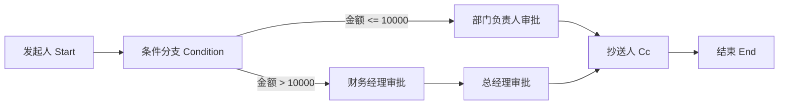

# 审批流 Workflow / Approval 模块设计

本文档基于当前 `PermissionSystem` 项目结构、AGENTS.md 约束和已有 RBAC、部门、通知中心、RabbitMQ、Hangfire、Outbox / Inbox 等平台能力，规划企业级审批流 Workflow / Approval 模块。

本步骤只做设计规划，不生成 WMS / ERP 业务代码，不修改现有权限系统实现。

## 1. 审批流总体目标

审批流模块用于为后续业务模块提供统一、可配置、可审计、可扩展的流程审批能力。目标是支持企业后台常见的可视化审批流设计器与运行时引擎，使业务模块只需要声明业务单据、发起参数和回调接口，即可接入统一审批能力。

核心能力：

- 支持流程定义、流程发布、版本管理和启停控制。
- 支持可视化节点编排：发起人、条件分支、审批人、抄送人、结束节点。
- 支持多种审批人解析方式：用户、角色、部门负责人、岗位、发起人、上级、表单字段指定人等。
- 支持多种审批方式：单人审批、会签、或签、依次审批。
- 支持条件分支表达式、默认分支、分支优先级和多条件组合。
- 支持流程实例、审批任务、审批记录、抄送记录和业务单据绑定。
- 支持撤回、拒绝、转交、加签、催办、超时提醒、自动跳过等企业级场景。
- 支持多租户、权限码控制、操作日志、审计追踪和通知中心集成。
- 支持通过 RabbitMQ / Hangfire 承载异步通知、超时任务、流程统计、补偿重试等后台任务。
- 为后续 WMS / ERP 业务模块提供低耦合接入方式，但不在本模块中实现任何 WMS / ERP 业务逻辑。

边界约束：

- Api 层只暴露控制器、鉴权、模型绑定，不直接访问 DbContext，不写业务流程。
- Application 层承载审批流用例、DTO、请求响应、流程编排服务。
- Domain 层承载流程实体、枚举、值对象和纯业务规则。
- Infrastructure 层承载 EF Core 配置、仓储、消息、后台任务实现。
- 所有数据库实体继承 `BaseEntity`，保留 `TenantId`、审计字段和软删除能力。
- 不实现自定义 JWT，不绕过现有 OpenIddict 和 PermissionAttribute 授权机制。

建议模块命名：

- 后端 Application 目录：`PermissionSystem.Application.Workflows`
- 后端 Domain 实体目录：`PermissionSystem.Domain.Entities`
- 后端 Api 控制器：`WorkflowDefinitionController`、`WorkflowInstanceController`、`WorkflowTaskController`
- 前端页面目录：`frontend/permission-admin/src/views/workflow`

## 2. 支持的节点类型

审批流定义使用节点和边组成有向图。节点保存配置，边保存流转关系，条件分支通过边和条件表达式决定下一节点。

### 2.1 Start 发起人节点

用途：

- 表示流程入口。
- 每个流程定义必须且只能有一个 Start 节点。
- 记录发起人范围、可发起部门、可发起角色、可发起业务类型等配置。

关键配置：

- `InitiatorScope`：全部用户、指定用户、指定角色、指定部门。
- `FormSchemaKey`：关联业务表单或动态表单定义。
- `BusinessType`：业务类型，例如 `purchase_order`、`inventory_adjustment`，只作为通用业务编码，不生成业务实现。
- `AllowDraft`：是否允许草稿。
- `CanWithdrawBeforeApproved`：是否允许首个审批节点处理前撤回。

### 2.2 Approver 审批人节点

用途：

- 表示需要审批处理的人工节点。
- 支持审批人解析、审批方式、超时规则、空审批人策略和按钮权限。

关键配置：

- `ApproverType`：指定用户、指定角色、指定部门负责人、指定岗位、发起人本人、发起人直属上级、发起人部门负责人、表单字段指定人。
- `ApprovalMode`：单人审批、会签、或签、依次审批。
- `AssigneeIds`：指定用户、角色、部门、岗位或字段编码集合。
- `EmptyAssigneePolicy`：自动通过、自动跳过、转交管理员、发起失败。
- `AllowTransfer`：是否允许转交。
- `AllowAddSign`：是否允许加签。
- `AllowRejectToStart`：是否允许驳回到发起人。
- `AllowRejectToPrevious`：是否允许驳回到上一节点。
- `TimeoutHours`：审批超时时间。
- `TimeoutAction`：提醒、自动通过、自动拒绝、升级给上级。

### 2.3 Cc 抄送人节点

用途：

- 表示流程流转到某一步时通知相关人员。
- 抄送不阻塞流程推进。

关键配置：

- `CcUserType`：指定用户、指定角色、部门负责人、发起人上级、表单字段指定人等。
- `CcTiming`：节点到达时、节点完成时、流程完成时、流程拒绝时。
- `AllowReadBusinessDetail`：是否允许查看业务单据详情。
- `NotificationTemplateCode`：通知模板编码。

### 2.4 Condition 条件分支节点

用途：

- 根据业务表单字段、发起人属性、组织属性、流程上下文决定流转路径。
- 条件分支节点本身不产生审批任务。

关键配置：

- 分支列表，每个分支对应一条或多条出边。
- 分支优先级，按从小到大或显式排序依次匹配。
- 默认条件，当所有条件均不满足时流转到默认分支。
- 条件组支持 AND / OR 嵌套。

示例流程：



### 2.5 End 结束节点

用途：

- 表示流程正常完成。
- 每个流程定义至少有一个 End 节点。
- 到达 End 节点后流程实例状态变更为已完成，并触发业务回调和完成通知。

关键配置：

- `CompletionAction`：仅完成、通知业务系统、触发异步事件。
- `NotificationTemplateCode`：完成通知模板。
- `BusinessCallbackPolicy`：同步回调、异步事件、失败重试策略。

## 3. 审批人配置方式

审批人解析应由 Application 层统一封装为 `IWorkflowAssigneeResolver`，不同配置方式通过策略模式扩展。解析过程必须带租户隔离，并复用当前用户、角色、部门、数据权限能力。

### 3.1 指定用户

配置：

- `ApproverType = Users`
- `AssigneeIds = [UserId...]`

规则：

- 仅允许选择同租户且启用状态的用户。
- 保存流程定义时校验用户是否存在。
- 运行时再次校验用户状态，避免已禁用用户收到任务。

适用场景：

- 固定审批人，如财务专员、行政负责人。

### 3.2 指定角色

配置：

- `ApproverType = Roles`
- `AssigneeIds = [RoleId...]`

规则：

- 运行时查询拥有指定角色的启用用户。
- 可结合发起人部门进行限制，例如只取同部门下拥有该角色的用户。
- 如果角色下无用户，按空审批人策略处理。

适用场景：

- 由角色池处理，如财务审批、法务审批、仓库主管审批。

### 3.3 指定部门负责人

配置：

- `ApproverType = DepartmentManager`
- `AssigneeIds = [DepartmentId...]` 或根据上下文动态取部门。

规则：

- 当前 `Department` 实体已有部门树基础，后续需要补充部门负责人字段或单独负责人关系表。
- 支持取指定部门负责人、发起人所在部门负责人、表单字段部门负责人。
- 多部门负责人可按或签、会签或依次审批配置执行。

适用场景：

- 行政、采购、仓储等按部门负责人审批。

### 3.4 指定岗位

配置：

- `ApproverType = Positions`
- `AssigneeIds = [PositionId...]`

规则：

- 当前项目尚未发现岗位实体，审批流设计预留岗位解析能力。
- 后续可新增 `Position`、`UserPosition` 等组织模型后接入。
- 在岗位能力落地前，前端可隐藏该配置项或标记为预留。

适用场景：

- 企业组织中按岗位任职人员审批，如采购经理、成本会计。

### 3.5 发起人本人

配置：

- `ApproverType = Initiator`

规则：

- 审批人即流程实例的 `InitiatorUserId`。
- 可用于提交确认、补充材料、复核确认等节点。

### 3.6 发起人直属上级

配置：

- `ApproverType = InitiatorDirectLeader`

规则：

- 当前用户实体尚未发现直属上级字段，设计预留 `ManagerUserId` 或组织关系解析接口。
- 若发起人无直属上级，按空审批人策略处理。
- 支持逐级审批扩展，例如审批金额越高，向上递归更多层级。

### 3.7 发起人部门负责人

配置：

- `ApproverType = InitiatorDepartmentManager`

规则：

- 根据 `WorkflowInstance.InitiatorDepartmentId` 查询部门负责人。
- 若发起人无部门或部门无负责人，按空审批人策略处理。
- 需要避免审批人等于发起人时形成无意义审批，可配置自动通过或仍需本人确认。

### 3.8 表单字段指定人

配置：

- `ApproverType = FormFieldUser`
- `AssigneeField = "managerUserId"` 或字段路径，例如 `"expense.ownerUserIds"`

规则：

- 从发起流程时传入的业务表单快照或业务字段上下文解析用户 ID。
- 字段类型支持单用户、多用户、角色、部门等扩展。
- 必须校验解析出的用户属于当前租户且状态有效。
- 不允许直接信任前端传入的显示名，只接受系统内用户 ID 或后端可验证的业务字段。

适用场景：

- 业务单据中已选择项目负责人、客户经理、仓库负责人等。

## 4. 审批方式

### 4.1 单人审批

规则：

- 节点只生成一个审批任务。
- 如果解析出多个候选人，需要配置选择策略：取第一个、发起人选择、管理员配置默认人、或按或签处理。
- 任一审批结果即为节点结果。

适用场景：

- 固定负责人审批。

### 4.2 会签

规则：

- 为所有审批人创建任务。
- 所有人通过后节点通过。
- 任一人拒绝时，默认节点拒绝并结束或驳回，除非配置为拒绝票数阈值。
- 支持会签通过比例，例如全部通过、超过 50%、超过 2/3。

关键字段：

- `RequiredApprovalCount`
- `RequiredApprovalRatio`
- `RejectPolicy`

适用场景：

- 多部门共同确认、委员会审批。

### 4.3 或签

规则：

- 为所有候选审批人创建任务。
- 任一人通过后节点通过，其余待办任务自动关闭为已取消。
- 任一人拒绝是否立即拒绝由 `RejectPolicy` 决定。

适用场景：

- 角色池抢单式审批，如任一财务专员审批即可。

### 4.4 依次审批

规则：

- 审批人按配置顺序或组织层级顺序依次处理。
- 当前审批人通过后才创建下一位审批人的任务。
- 任一环节拒绝时节点拒绝。

关键字段：

- `ApprovalOrder`：用户顺序、角色内排序、组织层级顺序。
- `CurrentStepIndex`：当前审批序号。

适用场景：

- 组长 -> 经理 -> 总监的串行审批。

## 5. 条件分支设计

条件分支由 `WorkflowCondition` 保存结构化表达式，避免在数据库中保存不可验证的脚本。初期只支持白名单字段、白名单操作符和 JSON 值；后续可扩展表达式引擎。

### 5.1 字段

字段来源：

- 业务表单字段：如 `amount`、`warehouseId`、`supplierId`。
- 发起人属性：如 `initiator.userId`、`initiator.departmentId`、`initiator.roleIds`。
- 流程上下文：如 `workflow.businessType`、`workflow.priority`。
- 系统字段：如 `tenantId`、`createdAt`，仅允许必要字段，不开放敏感字段。

字段元数据建议由业务模块注册：

- `FieldCode`
- `FieldName`
- `FieldType`：String、Number、Boolean、Date、DateTime、User、Department、Enum。
- `Operators`
- `OptionsProvider`：枚举或远程选项接口。

### 5.2 操作符

建议支持：

- `Equals`：等于。
- `NotEquals`：不等于。
- `GreaterThan`：大于。
- `GreaterThanOrEqual`：大于等于。
- `LessThan`：小于。
- `LessThanOrEqual`：小于等于。
- `Contains`：包含。
- `NotContains`：不包含。
- `In`：属于集合。
- `NotIn`：不属于集合。
- `Between`：区间。
- `IsEmpty`：为空。
- `IsNotEmpty`：不为空。

操作符必须根据字段类型过滤，例如数字字段不允许 `Contains`，日期字段允许区间比较。

### 5.3 值

值以 JSON 格式保存，Application 层按字段类型进行解析和校验。

示例：

```json
{
  "field": "amount",
  "operator": "GreaterThanOrEqual",
  "value": 10000
}
```

枚举、多选或用户字段示例：

```json
{
  "field": "applicantRoleIds",
  "operator": "In",
  "value": ["role-id-1", "role-id-2"]
}
```

### 5.4 多条件 AND / OR

条件表达式建议采用树结构：

```json
{
  "logic": "AND",
  "children": [
    {
      "field": "amount",
      "operator": "GreaterThan",
      "value": 10000
    },
    {
      "logic": "OR",
      "children": [
        {
          "field": "initiator.departmentId",
          "operator": "Equals",
          "value": "department-id-1"
        },
        {
          "field": "priority",
          "operator": "Equals",
          "value": "High"
        }
      ]
    }
  ]
}
```

运行规则：

- 同一条件组内按 `LogicType` 执行 AND / OR。
- 条件树最大深度建议限制为 3 到 5 层，防止配置过度复杂。
- 条件数量建议限制，例如单分支不超过 20 个基础条件。
- 条件计算必须可追踪，审批记录中保存命中分支和条件快照。

### 5.5 默认条件

规则：

- 每个 Condition 节点建议配置一个默认分支。
- 默认分支只能有一个。
- 默认分支优先级最低，只有其他条件都不命中时才执行。
- 如果没有默认分支且所有条件都不命中，流程进入异常状态，需要管理员处理或按定义配置自动拒绝。

## 6. 数据库表设计

所有实体继承 `BaseEntity`，默认包含：

- `Id`
- `TenantId`
- `CreatedAt`
- `CreatedBy`
- `UpdatedAt`
- `UpdatedBy`
- `IsDeleted`

以下表名按当前项目复数表名风格建议使用复数形式；文档标题保留需求中给出的实体名。

### 6.1 WorkflowDefinition

表名：`WorkflowDefinitions`

用途：

- 保存流程定义主信息。
- 支持草稿、发布、停用、版本管理。

字段：

| 字段 | 类型 | 说明 |
| --- | --- | --- |
| `Code` | nvarchar(100) | 流程编码，同租户唯一 |
| `Name` | nvarchar(200) | 流程名称 |
| `Description` | nvarchar(1000) | 描述 |
| `BusinessType` | nvarchar(100) | 业务类型编码 |
| `Version` | int | 版本号 |
| `Status` | int | Draft、Published、Disabled、Archived |
| `IsLatest` | bit | 是否最新版本 |
| `PublishedAt` | datetimeoffset | 发布时间 |
| `PublishedBy` | uniqueidentifier | 发布人 |
| `FormSchemaKey` | nvarchar(100) | 表单结构编码 |
| `DesignerJson` | nvarchar(max) | 前端设计器布局 JSON |
| `Remark` | nvarchar(1000) | 备注 |

索引：

- `TenantId + Code + Version` 唯一索引。
- `TenantId + BusinessType + Status + IsLatest` 普通索引。

### 6.2 WorkflowNode

表名：`WorkflowNodes`

用途：

- 保存流程节点定义。

字段：

| 字段 | 类型 | 说明 |
| --- | --- | --- |
| `WorkflowDefinitionId` | uniqueidentifier | 流程定义 ID |
| `NodeKey` | nvarchar(100) | 节点稳定键，前端设计器生成 |
| `NodeType` | int | Start、Approver、Cc、Condition、End |
| `Name` | nvarchar(200) | 节点名称 |
| `Sort` | int | 排序 |
| `ConfigJson` | nvarchar(max) | 节点配置 JSON |
| `PositionX` | decimal(18,2) | 设计器 X 坐标 |
| `PositionY` | decimal(18,2) | 设计器 Y 坐标 |
| `IsEnabled` | bit | 是否启用 |

索引：

- `TenantId + WorkflowDefinitionId + NodeKey` 唯一索引。
- `TenantId + WorkflowDefinitionId + NodeType` 普通索引。

### 6.3 WorkflowEdge

表名：`WorkflowEdges`

用途：

- 保存节点之间的有向连线。

字段：

| 字段 | 类型 | 说明 |
| --- | --- | --- |
| `WorkflowDefinitionId` | uniqueidentifier | 流程定义 ID |
| `SourceNodeId` | uniqueidentifier | 来源节点 |
| `TargetNodeId` | uniqueidentifier | 目标节点 |
| `EdgeKey` | nvarchar(100) | 连线稳定键 |
| `Name` | nvarchar(200) | 分支名称 |
| `Priority` | int | 条件匹配优先级 |
| `IsDefault` | bit | 是否默认分支 |
| `ConditionId` | uniqueidentifier | 条件 ID，可空 |

索引：

- `TenantId + WorkflowDefinitionId + SourceNodeId` 普通索引。
- `TenantId + WorkflowDefinitionId + EdgeKey` 唯一索引。

### 6.4 WorkflowCondition

表名：`WorkflowConditions`

用途：

- 保存条件分支表达式。

字段：

| 字段 | 类型 | 说明 |
| --- | --- | --- |
| `WorkflowDefinitionId` | uniqueidentifier | 流程定义 ID |
| `NodeId` | uniqueidentifier | 条件节点 ID |
| `Name` | nvarchar(200) | 条件名称 |
| `ExpressionJson` | nvarchar(max) | 结构化条件表达式 |
| `LogicType` | int | AND、OR，可作为根组冗余 |
| `Priority` | int | 优先级 |
| `IsDefault` | bit | 是否默认条件 |

索引：

- `TenantId + WorkflowDefinitionId + NodeId + Priority` 普通索引。

### 6.5 WorkflowInstance

表名：`WorkflowInstances`

用途：

- 保存一次流程运行实例。

字段：

| 字段 | 类型 | 说明 |
| --- | --- | --- |
| `WorkflowDefinitionId` | uniqueidentifier | 流程定义 ID |
| `WorkflowDefinitionCode` | nvarchar(100) | 流程编码快照 |
| `WorkflowDefinitionVersion` | int | 流程版本快照 |
| `BusinessType` | nvarchar(100) | 业务类型 |
| `BusinessId` | nvarchar(100) | 业务单据 ID，使用字符串适配不同模块 |
| `BusinessCode` | nvarchar(100) | 业务单号 |
| `Title` | nvarchar(300) | 流程标题 |
| `Status` | int | Running、Approved、Rejected、Withdrawn、Canceled、Exception |
| `CurrentNodeId` | uniqueidentifier | 当前节点，可空 |
| `InitiatorUserId` | uniqueidentifier | 发起人 |
| `InitiatorUserName` | nvarchar(100) | 发起人名称快照 |
| `InitiatorDepartmentId` | uniqueidentifier | 发起人部门 |
| `FormDataJson` | nvarchar(max) | 发起时表单数据快照 |
| `StartedAt` | datetimeoffset | 发起时间 |
| `CompletedAt` | datetimeoffset | 完成时间 |
| `RejectedAt` | datetimeoffset | 拒绝时间 |
| `WithdrawnAt` | datetimeoffset | 撤回时间 |
| `TraceId` | nvarchar(100) | 链路追踪 ID |

索引：

- `TenantId + BusinessType + BusinessId` 普通索引，可根据业务约束决定是否唯一。
- `TenantId + InitiatorUserId + Status + CreatedAt` 普通索引。
- `TenantId + Status + CreatedAt` 普通索引。

### 6.6 WorkflowTask

表名：`WorkflowTasks`

用途：

- 保存审批待办任务。

字段：

| 字段 | 类型 | 说明 |
| --- | --- | --- |
| `WorkflowInstanceId` | uniqueidentifier | 流程实例 ID |
| `WorkflowNodeId` | uniqueidentifier | 当前节点 ID |
| `TaskKey` | nvarchar(100) | 任务稳定键 |
| `AssigneeUserId` | uniqueidentifier | 审批人 |
| `AssigneeUserName` | nvarchar(100) | 审批人名称快照 |
| `Status` | int | Pending、Approved、Rejected、Transferred、Added、Canceled、Expired |
| `ApprovalMode` | int | 单人、会签、或签、依次审批 |
| `Sequence` | int | 依次审批序号 |
| `Action` | int | Approve、Reject、Transfer、AddSign |
| `Opinion` | nvarchar(1000) | 审批意见 |
| `DueAt` | datetimeoffset | 截止时间 |
| `HandledAt` | datetimeoffset | 处理时间 |
| `OriginalAssigneeUserId` | uniqueidentifier | 原审批人，用于转交 |
| `FromTaskId` | uniqueidentifier | 来源任务，用于加签/转交链路 |

索引：

- `TenantId + AssigneeUserId + Status + CreatedAt` 普通索引，用于待办。
- `TenantId + WorkflowInstanceId + WorkflowNodeId` 普通索引。
- `TenantId + TaskKey` 唯一索引。

### 6.7 WorkflowRecord

表名：`WorkflowRecords`

用途：

- 保存流程流转和人工操作记录。

字段：

| 字段 | 类型 | 说明 |
| --- | --- | --- |
| `WorkflowInstanceId` | uniqueidentifier | 流程实例 ID |
| `WorkflowTaskId` | uniqueidentifier | 任务 ID，可空 |
| `NodeId` | uniqueidentifier | 节点 ID，可空 |
| `NodeName` | nvarchar(200) | 节点名称快照 |
| `Action` | int | Start、Approve、Reject、Withdraw、Transfer、AddSign、Cc、Complete、System |
| `OperatorUserId` | uniqueidentifier | 操作人 |
| `OperatorUserName` | nvarchar(100) | 操作人名称快照 |
| `Opinion` | nvarchar(1000) | 意见 |
| `FromStatus` | int | 变更前状态 |
| `ToStatus` | int | 变更后状态 |
| `SnapshotJson` | nvarchar(max) | 关键上下文快照 |
| `OperatedAt` | datetimeoffset | 操作时间 |
| `TraceId` | nvarchar(100) | 链路追踪 ID |

索引：

- `TenantId + WorkflowInstanceId + OperatedAt` 普通索引。

### 6.8 WorkflowCc

表名：`WorkflowCcs`

用途：

- 保存流程抄送记录。

字段：

| 字段 | 类型 | 说明 |
| --- | --- | --- |
| `WorkflowInstanceId` | uniqueidentifier | 流程实例 ID |
| `WorkflowNodeId` | uniqueidentifier | 抄送节点 ID |
| `CcUserId` | uniqueidentifier | 抄送人 |
| `CcUserName` | nvarchar(100) | 抄送人名称快照 |
| `Status` | int | Unread、Read、Archived |
| `ReadAt` | datetimeoffset | 阅读时间 |
| `NotificationId` | uniqueidentifier | 通知中心消息 ID，可空 |

索引：

- `TenantId + CcUserId + Status + CreatedAt` 普通索引。
- `TenantId + WorkflowInstanceId + CcUserId` 普通索引。

### 6.9 WorkflowBusinessBinding

表名：`WorkflowBusinessBindings`

用途：

- 保存业务模块与流程定义之间的绑定关系。
- 让 WMS / ERP 等后续业务模块通过业务类型接入流程，不把业务逻辑写入审批流模块。

字段：

| 字段 | 类型 | 说明 |
| --- | --- | --- |
| `BusinessType` | nvarchar(100) | 业务类型编码 |
| `BusinessName` | nvarchar(200) | 业务名称 |
| `WorkflowDefinitionId` | uniqueidentifier | 当前绑定流程定义 |
| `WorkflowDefinitionCode` | nvarchar(100) | 流程编码 |
| `IsEnabled` | bit | 是否启用 |
| `StartPermissionCode` | nvarchar(200) | 发起权限码 |
| `ViewPermissionCode` | nvarchar(200) | 查看权限码 |
| `CallbackUrl` | nvarchar(500) | 可选业务回调地址，不建议初期开放外部 URL |
| `CallbackServiceKey` | nvarchar(100) | 推荐使用内部回调服务键 |
| `FormSchemaKey` | nvarchar(100) | 表单字段元数据键 |
| `Remark` | nvarchar(1000) | 备注 |

索引：

- `TenantId + BusinessType` 唯一索引。
- `TenantId + WorkflowDefinitionCode` 普通索引。

## 7. 后端接口设计

接口返回统一使用 `ApiResult` / `PagedResult`，控制器使用 `PermissionAttribute` 进行权限控制，所有写操作支持 `CancellationToken`，关键写接口建议接入幂等能力和操作日志。

### 7.1 流程定义接口

控制器：`WorkflowDefinitionController`

| 方法 | 路径 | 说明 | 权限码 |
| --- | --- | --- | --- |
| GET | `/api/workflow-definitions` | 分页查询流程定义 | `workflow.definition.view` |
| GET | `/api/workflow-definitions/{id}` | 获取流程定义详情 | `workflow.definition.view` |
| POST | `/api/workflow-definitions` | 创建流程定义草稿 | `workflow.definition.create` |
| PUT | `/api/workflow-definitions/{id}` | 更新流程定义草稿 | `workflow.definition.update` |
| DELETE | `/api/workflow-definitions/{id}` | 删除草稿或归档定义 | `workflow.definition.delete` |
| POST | `/api/workflow-definitions/{id}/publish` | 发布新版本 | `workflow.definition.publish` |
| POST | `/api/workflow-definitions/{id}/disable` | 停用流程定义 | `workflow.definition.disable` |
| POST | `/api/workflow-definitions/{id}/clone` | 复制为新草稿 | `workflow.definition.create` |
| POST | `/api/workflow-definitions/{id}/validate` | 校验流程图合法性 | `workflow.definition.update` |

校验规则：

- 必须有且仅有一个 Start 节点。
- 至少有一个 End 节点。
- 所有节点必须从 Start 可达。
- 除 End 外，不允许出现无出边的节点。
- Condition 节点必须至少有一条出边。
- Condition 节点建议有默认分支。
- 不允许保存无法解析的审批人配置。
- 已发布版本不可直接修改，只能复制为草稿并发布新版本。

### 7.2 流程实例接口

控制器：`WorkflowInstanceController`

| 方法 | 路径 | 说明 | 权限码 |
| --- | --- | --- | --- |
| GET | `/api/workflow-instances` | 分页查询流程实例 | `workflow.instance.view` |
| GET | `/api/workflow-instances/{id}` | 查询实例详情、节点状态和流转记录 | `workflow.instance.view` |
| POST | `/api/workflow-instances/start` | 发起流程 | `workflow.instance.start` 或业务绑定权限码 |
| POST | `/api/workflow-instances/{id}/withdraw` | 撤回流程 | `workflow.instance.withdraw` |
| POST | `/api/workflow-instances/{id}/cancel` | 管理员取消流程 | `workflow.instance.cancel` |
| GET | `/api/workflow-instances/by-business` | 按业务类型和业务 ID 查询流程 | `workflow.instance.view` |

发起请求建议字段：

- `BusinessType`
- `BusinessId`
- `BusinessCode`
- `Title`
- `FormData`
- `WorkflowDefinitionCode`，可选；不传时根据业务绑定取最新发布版本。

### 7.3 审批任务接口

控制器：`WorkflowTaskController`

| 方法 | 路径 | 说明 | 权限码 |
| --- | --- | --- | --- |
| GET | `/api/workflow-tasks/todo` | 我的待办 | `workflow.task.todo` |
| GET | `/api/workflow-tasks/done` | 我的已办 | `workflow.task.done` |
| GET | `/api/workflow-tasks/cc` | 我的抄送 | `workflow.task.cc` |
| GET | `/api/workflow-tasks/{id}` | 任务详情 | `workflow.task.view` |
| POST | `/api/workflow-tasks/{id}/approve` | 审批通过 | `workflow.task.approve` |
| POST | `/api/workflow-tasks/{id}/reject` | 审批拒绝 | `workflow.task.reject` |
| POST | `/api/workflow-tasks/{id}/transfer` | 转交 | `workflow.task.transfer` |
| POST | `/api/workflow-tasks/{id}/add-sign` | 加签 | `workflow.task.add-sign` |
| POST | `/api/workflow-tasks/{id}/urge` | 催办 | `workflow.task.urge` |
| POST | `/api/workflow-cc/{id}/read` | 标记抄送已读 | `workflow.task.cc` |

任务处理规则：

- 只有当前任务处理人可以审批、拒绝、转交、加签。
- 管理员可根据权限查看和干预，但干预动作必须记录 `WorkflowRecord`。
- 已完成、已取消、已转交的任务不可重复处理。
- 处理接口必须防重复提交。

### 7.4 业务绑定接口

控制器：`WorkflowBusinessBindingController`

| 方法 | 路径 | 说明 | 权限码 |
| --- | --- | --- | --- |
| GET | `/api/workflow-business-bindings` | 查询业务绑定 | `workflow.binding.view` |
| POST | `/api/workflow-business-bindings` | 创建绑定 | `workflow.binding.create` |
| PUT | `/api/workflow-business-bindings/{id}` | 更新绑定 | `workflow.binding.update` |
| POST | `/api/workflow-business-bindings/{id}/enable` | 启用绑定 | `workflow.binding.update` |
| POST | `/api/workflow-business-bindings/{id}/disable` | 停用绑定 | `workflow.binding.update` |

## 8. 前端页面设计

前端采用 Vue 3、TypeScript、Pinia、Vue Router、Axios wrapper、Element Plus，页面风格保持企业后台工作台体验。

### 8.1 菜单规划

建议菜单：

- 审批中心
  - 我的待办
  - 我的已办
  - 我的发起
  - 抄送我的
- 流程管理
  - 流程定义
  - 流程设计器
  - 业务绑定
  - 流程实例

### 8.2 流程定义列表

页面：`src/views/workflow/definition/index.vue`

布局：

- 搜索表单：流程名称、流程编码、业务类型、状态、是否最新版本。
- 表格：名称、编码、业务类型、版本、状态、发布时间、启停状态、操作。
- 分页：复用当前分页模式。
- 操作：新增、编辑草稿、复制、发布、停用、查看版本、删除草稿。

### 8.3 流程设计器

页面：`src/views/workflow/designer/index.vue`

核心区域：

- 左侧节点面板：Start、Approver、Cc、Condition、End。
- 中间画布：拖拽节点、连线、选择节点、缩放、自动布局。
- 右侧属性面板：根据节点类型展示配置表单。
- 顶部工具栏：保存草稿、校验、发布、撤销、重做、放大、缩小、适配画布。

设计原则：

- 节点配置使用 Element Plus 表单、选择器、树选择、用户选择弹窗。
- 审批人选择复用用户、角色、部门现有接口。
- 条件编辑器使用结构化规则组，不让管理员直接输入脚本。
- 发布前必须调用后端校验接口。
- 已发布版本只读，编辑时复制为草稿。

### 8.4 我的待办 / 已办 / 抄送

页面：

- `src/views/workflow/task/todo.vue`
- `src/views/workflow/task/done.vue`
- `src/views/workflow/task/cc.vue`

布局：

- 搜索表单：标题、业务类型、发起人、发起时间、状态。
- 表格：标题、业务单号、流程名称、当前节点、发起人、到达时间、截止时间、状态。
- 操作：查看、审批、拒绝、转交、加签、催办、标记已读。
- 审批弹窗：审批意见、附件预留、下一节点预览。

### 8.5 流程实例详情

页面：`src/views/workflow/instance/detail.vue`

内容：

- 基本信息：标题、业务类型、业务单号、发起人、状态、发起时间、完成时间。
- 流程图：展示节点状态、当前节点、已完成节点、拒绝节点。
- 审批记录时间线：发起、审批、拒绝、转交、加签、抄送、完成。
- 业务表单快照：只读展示，由业务模块提供渲染组件或字段元数据。
- 操作区：根据当前用户、任务状态和权限显示审批按钮。

### 8.6 业务绑定页面

页面：`src/views/workflow/binding/index.vue`

布局：

- 搜索表单：业务类型、业务名称、启用状态。
- 表格：业务类型、业务名称、绑定流程、流程版本、启用状态。
- 弹窗表单：选择流程定义、配置权限码、表单元数据键、回调服务键。

## 9. 审批流运行机制

### 9.1 发起流程

步骤：

1. 业务模块调用审批流发起接口，传入业务类型、业务 ID、标题、表单数据。
2. Application 层根据 `WorkflowBusinessBinding` 查找当前启用且已发布的流程定义。
3. 校验发起人权限、业务绑定状态、流程定义状态。
4. 创建 `WorkflowInstance`，保存流程定义版本快照、业务信息和表单数据快照。
5. 写入 `WorkflowRecord` 的 Start 记录。
6. 从 Start 节点开始计算下一节点。
7. 创建首批审批任务或抄送记录。
8. 发送待办通知。

事务边界：

- 实例、任务、记录、Outbox 消息应在同一业务事务内提交。
- 通知发送通过 Outbox / RabbitMQ 异步处理，避免通知失败导致流程发起失败。

### 9.2 计算下一节点

步骤：

1. 获取当前节点出边。
2. 如果当前节点为 Condition，按优先级计算条件表达式。
3. 命中第一条满足条件的边。
4. 未命中时选择默认边。
5. 找到目标节点。
6. 根据目标节点类型执行：
   - Approver：解析审批人并创建任务。
   - Cc：创建抄送记录并继续推进到下一节点。
   - Condition：递归计算条件分支。
   - End：完成流程。

防护规则：

- 单次推进必须限制最大节点跳转次数，防止流程图配置成循环。
- 若出现找不到下一节点、条件不命中且无默认分支、审批人为空且策略不允许跳过，则实例进入 `Exception` 状态。
- 异常状态必须允许管理员查看原因并进行人工处理。

### 9.3 创建审批任务

步骤：

1. 根据节点配置解析审批人。
2. 去重并过滤禁用用户、跨租户用户。
3. 根据审批方式创建任务：
   - 单人审批：创建一个任务。
   - 会签：为全部审批人创建 Pending 任务。
   - 或签：为全部候选人创建 Pending 任务。
   - 依次审批：只创建第一位审批人的 Pending 任务。
4. 计算 `DueAt`。
5. 写入任务创建记录和通知 Outbox 消息。

空审批人策略：

- `AutoApprove`：记录系统自动通过并继续推进。
- `AutoSkip`：记录系统跳过并继续推进。
- `AssignToAdmin`：分配给流程管理员。
- `FailStart`：发起阶段失败。
- `EnterException`：运行中进入异常状态。

### 9.4 审批通过

步骤：

1. 校验当前用户是否为任务处理人。
2. 校验任务状态为 Pending。
3. 更新任务状态为 Approved，保存审批意见和处理时间。
4. 写入 `WorkflowRecord`。
5. 根据审批方式判断节点是否完成：
   - 单人审批：节点完成。
   - 会签：所有必需任务通过后完成。
   - 或签：当前通过即完成，取消其他待办。
   - 依次审批：如果还有下一审批人，创建下一任务；否则节点完成。
6. 节点完成后计算下一节点。

### 9.5 审批拒绝

步骤：

1. 校验任务处理权限和任务状态。
2. 更新当前任务为 Rejected。
3. 根据节点配置决定拒绝策略：
   - 直接结束流程，实例状态为 Rejected。
   - 驳回到发起人，创建发起人补充任务。
   - 驳回到上一审批节点。
   - 会签场景按拒绝策略判断是否立即拒绝。
4. 取消不再需要的待办任务。
5. 写入审批记录和通知消息。
6. 如果流程最终拒绝，触发业务回调或事件。

### 9.6 撤回

规则：

- 发起人可在配置允许的阶段撤回。
- 通常仅允许在首个审批节点未处理前撤回；企业配置可放宽。
- 撤回后实例状态为 Withdrawn，待办任务全部取消。
- 写入撤回记录，并通知已收到待办或抄送的用户。
- 撤回不删除流程数据，保留审计记录。

### 9.7 转交

规则：

- 当前审批人可将任务转交给同租户启用用户。
- 转交后原任务状态为 Transferred，并创建新任务。
- 新任务保留 `OriginalAssigneeUserId` 和 `FromTaskId`。
- 转交不能改变流程定义，不影响节点审批方式。
- 是否允许转交由节点配置和权限码共同控制。

### 9.8 加签

加签类型：

- 前加签：当前审批人处理前先让新增审批人处理。
- 后加签：当前审批人通过后再让新增审批人处理。
- 并加签：新增审批人与当前审批人共同处理。

规则：

- 加签必须记录来源任务和发起加签人。
- 加签审批人不得与当前待办重复，除非业务明确允许。
- 加签任务完成后按节点原审批方式继续推进。
- 是否允许加签由节点配置和权限码共同控制。

### 9.9 抄送

规则：

- Cc 节点不阻塞流程。
- 抄送记录写入 `WorkflowCc`。
- 抄送消息进入通知中心。
- 抄送人可以查看流程详情和业务快照，但是否可查看完整业务详情由业务绑定和权限码控制。

### 9.10 完成流程

步骤：

1. 流程推进到 End 节点。
2. 更新 `WorkflowInstance.Status = Approved`，设置 `CompletedAt`。
3. 写入完成记录。
4. 触发业务完成回调或发布领域事件 / 集成事件。
5. 发送流程完成通知给发起人、相关审批人和配置的抄送人。
6. 后台任务可异步刷新流程统计、归档缓存、生成审计摘要。

## 10. 权限码设计

权限码沿用当前 `Permission`、`RolePermission`、`PermissionAttribute` 体系，按资源和动作命名。

### 10.1 流程定义权限

- `workflow.definition.view`：查看流程定义。
- `workflow.definition.create`：创建流程定义。
- `workflow.definition.update`：编辑流程定义。
- `workflow.definition.delete`：删除流程定义草稿或归档。
- `workflow.definition.publish`：发布流程定义。
- `workflow.definition.disable`：停用流程定义。

### 10.2 流程实例权限

- `workflow.instance.view`：查看流程实例。
- `workflow.instance.start`：发起通用流程。
- `workflow.instance.withdraw`：撤回本人流程。
- `workflow.instance.cancel`：管理员取消流程。
- `workflow.instance.admin`：流程实例管理。

### 10.3 审批任务权限

- `workflow.task.view`：查看任务详情。
- `workflow.task.todo`：查看我的待办。
- `workflow.task.done`：查看我的已办。
- `workflow.task.cc`：查看抄送我的。
- `workflow.task.approve`：审批通过。
- `workflow.task.reject`：审批拒绝。
- `workflow.task.transfer`：转交。
- `workflow.task.add-sign`：加签。
- `workflow.task.urge`：催办。

### 10.4 业务绑定权限

- `workflow.binding.view`：查看业务绑定。
- `workflow.binding.create`：创建业务绑定。
- `workflow.binding.update`：更新业务绑定。
- `workflow.binding.delete`：删除或停用业务绑定。

### 10.5 业务模块权限组合

后续 WMS / ERP 模块接入时，建议业务模块保留自己的业务权限码，例如：

- `wms.receipt.submit`
- `wms.receipt.view`
- `erp.purchase-order.submit`
- `erp.purchase-order.view`

审批流只校验通用流程权限和业务绑定中的 `StartPermissionCode` / `ViewPermissionCode`，不直接硬编码任何 WMS / ERP 权限。

## 11. 通知中心集成设计

当前项目已有通知中心、通知模板、用户通知、SignalR 实时推送、RabbitMQ 通知消费能力，审批流应复用这些能力。

### 11.1 通知场景

建议通知事件：

- `WorkflowTaskCreated`：审批待办创建。
- `WorkflowTaskApproved`：任务已通过。
- `WorkflowTaskRejected`：任务已拒绝。
- `WorkflowTaskTransferred`：任务已转交。
- `WorkflowTaskAddedSign`：任务被加签。
- `WorkflowInstanceStarted`：流程已发起。
- `WorkflowInstanceWithdrawn`：流程已撤回。
- `WorkflowInstanceCompleted`：流程已完成。
- `WorkflowInstanceRejected`：流程已拒绝。
- `WorkflowCcCreated`：收到流程抄送。
- `WorkflowTaskUrged`：收到催办。
- `WorkflowTaskTimeoutWarning`：审批即将超时。
- `WorkflowTaskExpired`：审批已超时。

### 11.2 通知模板

通知模板建议使用当前 `NotificationTemplate` 能力，模板变量包括：

- `WorkflowTitle`
- `WorkflowName`
- `BusinessType`
- `BusinessCode`
- `InitiatorName`
- `NodeName`
- `TaskId`
- `InstanceId`
- `ActionUserName`
- `ActionTime`
- `Opinion`

### 11.3 通知发送方式

推荐路径：

1. 审批流事务内写入 `OutboxMessage`。
2. Outbox Publisher 通过 RabbitMQ 发布通知事件。
3. Notification Consumer 消费事件并创建 `Notification` / `UserNotification`。
4. SignalR 向在线用户实时推送。
5. 前端通知中心、待办角标刷新。

容错：

- 通知失败不回滚审批主流程。
- Outbox 支持重试和失败查询。
- 通知内容不能包含敏感字段或完整业务表单，仅包含必要摘要和跳转 ID。

## 12. RabbitMQ / Hangfire 集成设计

### 12.1 RabbitMQ 使用场景

当前项目已有 `IMessageBus`、RabbitMQ 实现、NullMessageBus、Outbox / Inbox 能力。审批流建议通过可靠消息处理跨模块异步事件。

事件建议：

- `WorkflowInstanceStartedEvent`
- `WorkflowTaskCreatedEvent`
- `WorkflowTaskCompletedEvent`
- `WorkflowInstanceCompletedEvent`
- `WorkflowInstanceRejectedEvent`
- `WorkflowCcCreatedEvent`
- `WorkflowBusinessCallbackRequestedEvent`

消息设计原则：

- 消息只携带 ID、租户 ID、业务类型、业务 ID、事件类型和必要快照。
- 不在消息中携带完整敏感表单数据。
- 消费端通过 Inbox 去重，保证幂等。
- 业务回调失败时可重试，不影响主流程状态一致性。

### 12.2 Hangfire 使用场景

当前项目已有 Hangfire 基础设施和 Worker 项目。审批流建议将以下任务交给 Hangfire：

- 审批任务超时检查。
- 审批即将超时提醒。
- 催办频率限制与延迟发送。
- 流程异常补偿扫描。
- 业务回调失败重试。
- 流程统计报表异步汇总。
- 历史流程归档任务。

任务建议：

| 任务 | 类型 | 频率 |
| --- | --- | --- |
| `WorkflowTaskTimeoutScanJob` | Recurring | 每 5 分钟 |
| `WorkflowTaskReminderJob` | Delayed / Recurring | 按节点配置 |
| `WorkflowCallbackRetryJob` | Delayed | 失败后指数退避 |
| `WorkflowExceptionCompensationJob` | Recurring | 每 10 分钟 |
| `WorkflowArchiveJob` | Recurring | 每天低峰期 |

### 12.3 一致性策略

- 流程状态变更和 Outbox 写入使用同一数据库事务。
- RabbitMQ 只负责通知和集成事件，不作为审批流主状态存储。
- Hangfire 任务执行前必须重新查询数据库状态，避免处理过期任务。
- 后台任务必须幂等，例如任务已审批时超时 Job 直接跳过。

## 13. 与后续 WMS / ERP 业务模块的接入方式

审批流模块作为平台能力，不依赖 WMS / ERP 业务实体，不生成业务代码。后续业务模块通过业务类型、业务 ID、表单字段元数据和回调服务接入。

### 13.1 接入步骤

1. 业务模块定义业务类型编码，例如 `wms.receipt`、`erp.purchase-order`。
2. 业务模块注册表单字段元数据，用于条件分支和详情展示。
3. 管理员在业务绑定页面将业务类型绑定到已发布流程定义。
4. 业务模块在提交时调用审批流发起接口。
5. 审批流运行过程中通过业务 ID 关联业务单据。
6. 流程完成、拒绝、撤回时，审批流发布事件或调用业务回调服务。
7. 业务模块根据回调更新单据状态。

### 13.2 推荐业务状态机

业务模块不应直接复用审批流内部状态，而应维护自己的业务状态：

- `Draft`：草稿。
- `PendingApproval`：审批中。
- `Approved`：审批通过。
- `Rejected`：审批拒绝。
- `Withdrawn`：已撤回。
- `Canceled`：已取消。

审批流负责审批过程，业务模块负责业务单据生命周期。

### 13.3 业务回调接口设计

推荐使用内部服务接口，而不是直接开放外部 URL：

```text
IWorkflowBusinessCallback
  - BusinessType
  - OnWorkflowStartedAsync(...)
  - OnWorkflowApprovedAsync(...)
  - OnWorkflowRejectedAsync(...)
  - OnWorkflowWithdrawnAsync(...)
  - OnWorkflowCanceledAsync(...)
```

业务模块实现对应 `BusinessType` 的回调服务，审批流通过 `CallbackServiceKey` 或 `BusinessType` 路由。

回调要求：

- 幂等：同一事件重复回调不能造成重复状态变更。
- 可重试：短暂失败通过 Hangfire 延迟重试。
- 可审计：记录回调结果、错误信息和 TraceId。
- 低耦合：审批流不引用具体 WMS / ERP 实体。

### 13.4 条件字段接入

业务模块向审批流提供字段元数据：

- 字段编码：`amount`
- 字段名称：`金额`
- 字段类型：`Number`
- 支持操作符：`GreaterThan`、`LessThanOrEqual`、`Between`
- 选项来源：静态枚举或业务模块查询接口。

发起流程时，业务模块传入可用于条件计算的字段快照。审批流只依赖快照计算，不在条件计算阶段直接查询业务库，降低模块耦合。

### 13.5 权限接入

接入原则：

- 发起按钮由业务权限和流程绑定共同决定。
- 审批按钮由审批任务归属和审批流权限共同决定。
- 查看业务详情由业务模块自己的查看权限决定。
- 审批流管理权限不等于业务单据管理权限。

示例：

- 用户拥有 `erp.purchase-order.submit`，且采购订单绑定了启用流程，才能发起采购订单审批。
- 用户是当前任务处理人，且拥有 `workflow.task.approve`，才能审批通过。
- 用户是抄送人但没有业务查看权限时，只能查看审批摘要，不能查看完整业务详情。

## 14. 枚举和值对象建议

建议在 Domain 层定义以下枚举，避免魔法字符串扩散：

- `WorkflowDefinitionStatus`：Draft、Published、Disabled、Archived。
- `WorkflowNodeType`：Start、Approver、Cc、Condition、End。
- `WorkflowInstanceStatus`：Running、Approved、Rejected、Withdrawn、Canceled、Exception。
- `WorkflowTaskStatus`：Pending、Approved、Rejected、Transferred、Added、Canceled、Expired。
- `WorkflowApprovalMode`：Single、Countersign、OrSign、Sequential。
- `WorkflowApproverType`：Users、Roles、DepartmentManager、Positions、Initiator、InitiatorDirectLeader、InitiatorDepartmentManager、FormFieldUser。
- `WorkflowConditionOperator`：Equals、NotEquals、GreaterThan、GreaterThanOrEqual、LessThan、LessThanOrEqual、Contains、NotContains、In、NotIn、Between、IsEmpty、IsNotEmpty。
- `WorkflowRecordAction`：Start、Approve、Reject、Withdraw、Transfer、AddSign、Cc、Complete、System。
- `WorkflowEmptyAssigneePolicy`：AutoApprove、AutoSkip、AssignToAdmin、FailStart、EnterException。
- `WorkflowTimeoutAction`：NotifyOnly、AutoApprove、AutoReject、EscalateToLeader。

## 15. 扩展性与风险控制

### 15.1 扩展性

- 节点配置统一保存在 `ConfigJson`，但关键字段仍应冗余成结构化列，方便查询和统计。
- 审批人解析、条件计算、业务回调、通知发送均使用接口隔离，便于后续替换实现。
- 流程定义发布后不可变，实例始终绑定发布时版本，避免历史流程受新定义影响。
- 业务模块通过 `BusinessType` 和回调服务接入，审批流模块不引用具体业务实体。

### 15.2 风险控制

- 条件表达式不开放任意脚本，避免安全风险。
- 表单字段指定人必须后端校验，不能信任前端显示值。
- 审批任务处理接口必须防重复提交。
- 转交、加签、管理员干预必须完整记录审计。
- 流程图校验必须防止无终点、孤立节点、循环死路。
- 通知和回调异步化，但主流程状态以数据库为准。
- 超时任务和消息消费必须幂等。

## 16. 分阶段落地建议

第一阶段：基础审批闭环

- 流程定义、节点、边、实例、任务、记录、抄送、业务绑定。
- 支持 Start、Approver、Cc、Condition、End。
- 支持指定用户、指定角色、发起人本人、发起人部门负责人。
- 支持单人审批、会签、或签。
- 支持基础条件分支和默认分支。
- 支持待办、已办、抄送、实例详情。

第二阶段：企业级增强

- 支持依次审批、转交、加签、催办、撤回。
- 支持超时提醒、自动通过、自动拒绝。
- 支持通知模板、SignalR 实时待办刷新。
- 支持流程异常处理和后台补偿。

第三阶段：组织与业务深度集成

- 补充岗位、直属上级、部门负责人等组织能力。
- 支持业务字段元数据注册和动态详情渲染。
- 支持业务回调服务、流程统计、流程性能分析。
- 支持更丰富的 WMS / ERP 业务模块接入，但仍保持审批流模块独立。

## 17. 当前实现与联调结论

截至本次联调，审批流模块已形成基础闭环：

- 流程定义管理：支持列表、新增、编辑、删除未发布定义、保存设计器、发布、停用、复制版本。
- 可视化设计器：支持 Start、Approver、Cc、Condition、End 节点；支持条件分支、默认条件、节点配置、保存 JSON、重新打开后按边关系回显分支结构。
- 运行引擎：支持按 `BusinessType` 绑定发布流程定义，发起实例，计算条件分支，创建审批任务，处理同意、拒绝、撤回、转交、加签、抄送和完成。
- 我的审批：支持待我审批、我已审批、我发起的、抄送我的、实例详情和审批记录时间线。
- 权限：沿用 `PermissionAttribute` 和既有 RBAC，不绕过现有权限系统；接口未登录走认证中间件，无权限由权限处理器返回 403。
- 通知：审批任务、抄送、拒绝、完成会写入通知 Outbox；通知异常被捕获并记录 warning，不阻断主审批事务。
- 事务：设计器保存、发布、删除、审批动作均通过 `IUnitOfWork.ExecuteInTransactionAsync` 保证状态一致。

当前已落地的审批人解析方式：

- 指定用户。
- 指定角色。
- 发起人本人。
- 表单字段指定人。

当前预留但未完整落地的审批人解析方式：

- 指定部门负责人。
- 指定岗位。
- 发起人直属上级。
- 发起人部门负责人。

当前已落地的审批方式：

- 单人审批：创建一个任务，通过后进入下一节点。
- 会签：为所有审批人创建任务，全部通过后进入下一节点。
- 或签：任一审批人通过后进入下一节点，并取消其他待处理任务。
- 依次审批：基础实现，按解析出的审批人顺序逐个创建任务。

当前已落地的条件操作符：

- `=`、`!=`、`>`、`>=`、`<`、`<=`。
- `contains`。
- `in`。
- 条件组支持基础 `AND` / `OR`。
- 条件节点必须至少有一条默认分支。

仍需后续业务接入时人工确认：

- 业务模块如何创建实际单据、何时调用 `/api/workflow/instances/start`。
- 业务表单详情如何从 JSON 展示升级为真实业务表单。
- 部门负责人、岗位、直属上级字段落地后的审批人解析。
- RabbitMQ / Hangfire 在目标部署环境中的启用策略、失败重试和监控告警。
## 18. 业务单据接入审批流当前落地

本次在通用审批流之上补齐了业务单据接入底座。审批流模块仍然不依赖采购订单、销售订单、入库单、出库单等真实业务模块；真实业务模块通过 `BusinessType`、业务 ID、表单快照和业务回调 Handler 接入。

### 18.1 BusinessType 与业务流程绑定

- `BusinessType` 是业务单据接入审批流的稳定编码，例如 `DemoApprovalOrder`、`PurchaseOrder`、`SalesOrder`。
- `WorkflowBusinessBinding` 负责把某个 `BusinessType` 绑定到一个已发布的 `WorkflowDefinition`。
- 同一个 `BusinessType` 同一时间只能启用一个流程绑定。
- 禁用绑定后，该业务类型不能再提交新的审批；已发起的 `WorkflowInstance` 不受影响。
- 绑定流程必须是已发布状态，避免业务单据提交到草稿或未校验流程。

### 18.2 单据审批状态

业务单据推荐实现 `IApprovalBusinessEntity`，并维护独立的 `ApprovalStatus`：

- `Draft`：草稿。
- `Pending`：审批中。
- `Approved`：审批通过。
- `Rejected`：审批拒绝。
- `Withdrawn`：已撤回。
- `Cancelled`：已取消。

审批流状态和业务单据状态各自独立。审批流负责流转，业务单据通过回调同步自己的业务生命周期。

### 18.3 业务回调 Handler

业务模块通过实现 `IWorkflowBusinessHandler` 接收审批生命周期回调：

```text
IWorkflowBusinessHandler
  - BusinessType
  - OnWorkflowStartedAsync(...)
  - OnWorkflowApprovedAsync(...)
  - OnWorkflowRejectedAsync(...)
  - OnWorkflowWithdrawnAsync(...)
  - OnWorkflowCancelledAsync(...)
```

审批流引擎根据 `BusinessType` 通过 `IWorkflowBusinessHandlerResolver` 查找处理器。找不到处理器时返回明确业务错误，避免流程已启动但业务单据无法回写。

### 18.4 DemoApprovalOrder 示例

`DemoApprovalOrder` 是轻量验证单据，不代表真实 ERP / WMS 模块。它用于验证：

- 创建草稿单据。
- 通过 `BusinessType = DemoApprovalOrder` 找到启用流程绑定。
- 提交审批时传入 `amount`、`departmentId`、`applicantUserId`、`applicantUserName`。
- 条件分支可以使用 `amount > 10000`、`departmentId = xxx` 等规则。
- 流程发起后单据状态变为 `Pending`。
- 审批通过后单据状态变为 `Approved`。
- 审批拒绝后单据状态变为 `Rejected`。
- 发起人撤回后单据状态变为 `Withdrawn`。

### 18.5 配置与验证步骤

1. 在审批管理 / 流程定义中创建流程定义。
2. 进入设计器，配置 Start、Approver、Cc、Condition、End 节点。
3. 发布流程定义。
4. 在审批管理 / 业务流程绑定中新增绑定，设置 `BusinessType = DemoApprovalOrder` 并选择已发布流程。
5. 在示例模块 / Demo 审批单中新建草稿单据。
6. 提交审批，后端自动使用业务绑定发起流程。
7. 审批人在待我审批中同意或拒绝。
8. 回到 Demo 单据详情检查审批状态和 `WorkflowInstanceId`。

### 18.6 扩展到真实业务

真实业务模块接入时只需要：

- 定义稳定的 `BusinessType`。
- 业务单据实现 `IApprovalBusinessEntity` 或保持等价字段。
- 实现对应的 `IWorkflowBusinessHandler`，在 Started / Approved / Rejected / Withdrawn / Cancelled 回调中更新单据状态。
- 提交审批时传入业务 ID、标题和用于条件判断的 `FormData`。
- 在业务流程绑定页面把 `BusinessType` 绑定到已发布流程。

审批流模块不应引用具体采购、销售、仓储实体。采购订单、销售订单、入库单、出库单、报销单等后续模块只通过接口和 `BusinessType` 接入。
